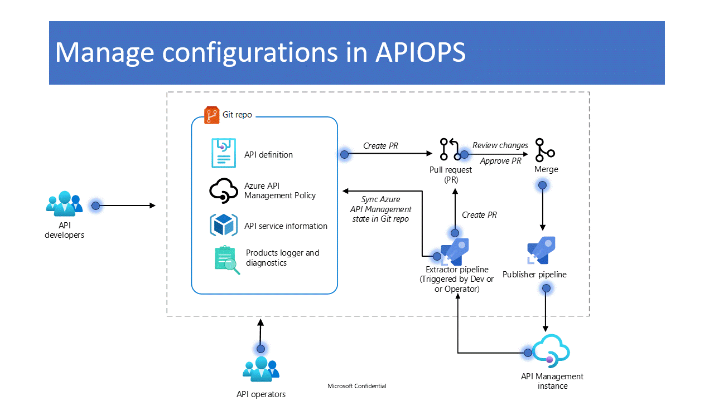

#  Code Of Conduct

Before we dive into learning about the APIOPs tool we would like to share some guidance on how to navigate the associated Github repo as you learn your way around the tool:
- Always refer to the [wiki](https://github.com/Azure/apiops/wiki) for detailed configuration setup
- Always use the latest [release](https://github.com/Azure/apiops/releases) which includes the latest features and bug fixes
- Please use the [issues](https://github.com/Azure/apiops/issues) section to report any issues that you encounter as well as any requested features that you would like to raise to the development team. Always remember to close your issues when its gets resolved 
- Remember to subscribe to this repo (at least subscribe to be notified about new releases) to stay in the loop as we are always adding new features and squashing these pesky bugs
- Please read this guide before opening any issues
- This is an open source project and hence we are always accepting contributions from the community so make sure you fork and submit your PRs. We take them seriously and they help us make the tool better

## Video Guide

Please note that the videos below serve as a good starting point but it is recommended to spend some time reading the detailed documentation found [under the Github page](https://azure.github.io/apiops/) and [the wiki](https://github.com/Azure/apiops/wiki).

Check this video for a 360 overview of the APIOPS tool. 

Check this video for a step by step guide that demonstrates setting up a Dev,QA, and Prod envirionments in Azure DevOps. Keep in mind that we also support Github even though its not demonstrated in this video.

#  Versions

Please note that starting with release V.3.0.0 we changed the way the updates to the system get delivered. Thus when reading the docs you will notice that there are some sections that are designated with the <= V.3.0.0 and >= V.3.0.0 suffixes to distinguish between the old and the new update delivery methodology. We recommend switching to the new methodology whenever possible as it greatly simplifies fetching the latest version of the code. 

## Old method (version < 3.0.0)

Each time a new release was pushed you would have to:
- Download the updated code folder as well as the updated pipelines
- You would have to run the publish-extractor and publish-publisher pipelines and store the resulting binaries in your own internal feed
- We dropped the publish-publisher and publish-extractor pipelines as we now host the binaries for you. If you would rather host the binaries yourself you still have access to the source code which you can download and build yourself. Just keep in mind that these deprecated pipelines now live in the releases themselves and won't be found in the repository.

## New method (version >= 3.0.0)

- The binaries are now hosted for you on the public github repo as part of the release
- Utilizing the new version simply involves pointing the pipelines to the new version by changing environment variables (refer to the docs on how to achieve that). No more rebuilding or hosting of binaries
- You only have to download the updated pipelines if they are updated. As part of the release we now push two different sets of pipelines. The Azure_DevOps.zip if you are a Azure Devops user and Github.zip if you are a Github user
- If you would still rather host the extractor and publisher binaries within your own environment you have two options:
    - We publish the compiled publisher and extractor binaries as part of the release so you can download these and host them internally if you want
    - The publish-publisher and publish-extractor pipelines are now legacy pipelines that can be found under the V.2.x release if you still need access to them. Also note that we still include the source code as part of the Source code (zip) in each release

#  About this Tool

APIOps applies the concepts of DevOps to Azure API Management. This enables everyone involved in the lifecycle of API design, development, and deployment with self-service and automated tools to ensure the quality of the specifications and APIs that they're building. APIOps places the Azure API Management infrastructure under version control to achieve these goals. Rather than making changes directly in API Management portal, most operations happen through code changes that can be reviewed and audited. In this section, we include links to both a complementary Guide and Wiki to get you started with the tool.

Please bear in mind that APIOPS is designed to facilitate the promotion of changes across different Azure API Management (APIM) instances. While the animation below illustrates changes within the same instance, it's important to note that you can effortlessly apply your modifications across various Azure APIM instances using the supported configuration system. We advise taking some time to explore the [wiki](https://github.com/Azure/apiops/wiki/Configuration) and [documentation](https://azure.github.io/apiops/apiops/5-publishApimArtifacts/apiops-azdo-4-1-pipeline.html) to grasp the functioning of configuration overrides when promoting changes across different environments.

## Complementary Guide

This guide is designed to bring a 400-level understanding of automating API deployments in Azure Api Management. This is meant to be a hands-on lab experience, all instructions are provided, but a basic level of understanding of apis, devops and gitops is expected.
This guide will guide you through the concept of APIOps. It applies the concepts of GitOps and DevOps to API deployment. By using practices from these two methodologies, APIOps can enable everyone involved in the lifecycle of API design, development, and deployment with self-service and automated tools to ensure the quality of the specifications and APIs that they're building.
[This Guide is delivered using Github Pages and Just-The-Docs theme](https://azure.github.io/apiops/).

## Wiki

The Wiki covers all of our supported resources. Think about it as being more resource-focused with deeper dives, as opposed to the aforementioned guide which is more scenario-based and holistic. So in essence you need to read both to have a successful adoption of the tool. [The wiki can be found on wiki tab within this repo or by following this link](https://github.com/Azure/apiops/wiki).

# Roadmap

To stay up-to-date with the APIOps roadmap, please follow it closely.
To stay updated on the APIOps roadmap, please make sure to monitor it closely [here](https://github.com/Azure/apiops/projects?query=is%3Aopen).

# Contributing

This project welcomes contributions and suggestions.  Most contributions require you to agree to a
Contributor License Agreement (CLA) declaring that you have the right to, and actually do, grant us
the rights to use your contribution. For details, visit https://cla.opensource.microsoft.com.

When you submit a pull request, a CLA bot will automatically determine whether you need to provide
a CLA and decorate the PR appropriately (e.g., status check, comment). Simply follow the instructions
provided by the bot. You will only need to do this once across all repos using our CLA.

This project has adopted the [Microsoft Open Source Code of Conduct](https://opensource.microsoft.com/codeofconduct/).
For more information see the [Code of Conduct FAQ](https://opensource.microsoft.com/codeofconduct/faq/) or
contact [opencode@microsoft.com](mailto:opencode@microsoft.com) with any additional questions or comments.

# Supporting Tools

While the APIOPs tool does not have built-in support for promoting the migration of the APIM Dev Portal, there is another tool available that offers such functionality. We suggest you explore that tool which can be found [here](https://github.com/seenu433/apim-dev-portal-migration).

# Trademarks

This project may contain trademarks or logos for projects, products, or services. Authorized use of Microsoft 
trademarks or logos is subject to and must follow 
[Microsoft's Trademark & Brand Guidelines](https://www.microsoft.com/en-us/legal/intellectualproperty/trademarks/usage/general).
Use of Microsoft trademarks or logos in modified versions of this project must not cause confusion or imply Microsoft sponsorship.
Any use of third-party trademarks or logos are subject to those third-party's policies.
