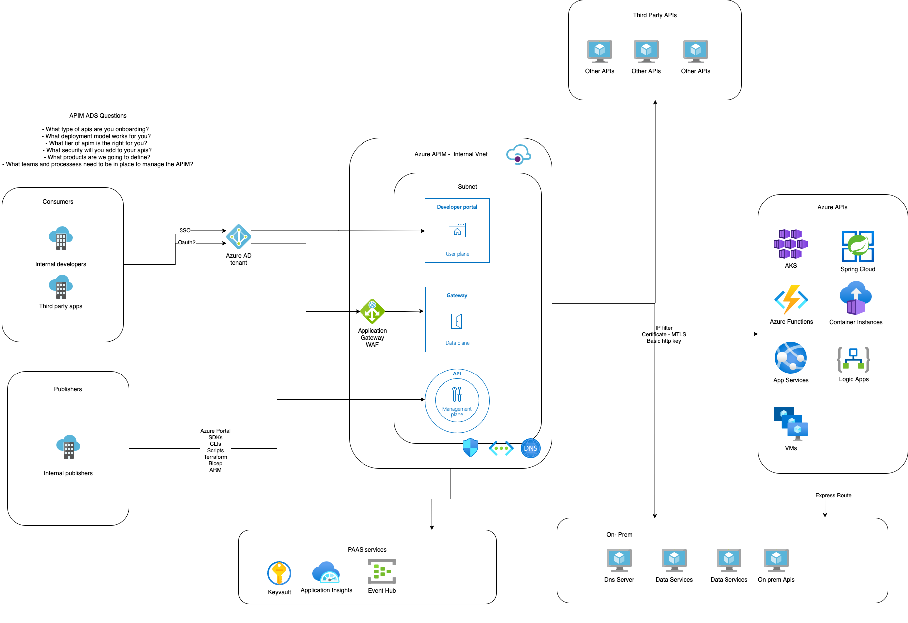

## Additional Topics - Architecture Design Session

In this section we provide you with a template architecture diagram for your apim baseline architecture. We recommend you take the time and answer the following questions:

- What type of apis are you onboarding to Azure Apim?   
- What deployment model works for you(no vnet, internal, external)?  
- What tier of apim is the right for you?  
- What security will you add to your apis? 
- What products are we going to define? 
- What teams and processess need to be in place to manage the Azure Apim?

| <a href="https://app.diagrams.net/#Uhttps%3A%2F%2Fraw.githubusercontent.com%2FAzure%2Fapim-lab%2Fmain%2Fassets%2Fdiagrams%2FapimADSv2.drawio" target="_blank">Edit As New</a> 

Download Diagram:
- [drawio](../../assets/diagrams/apimADSv2.drawio)
- [drawio editable svg](../../assets/diagrams/apimADSv2.svg)
- [drawio editable png](../../assets/diagrams/apimADSv2.png)
- [Visio](../../assets/diagrams/apimADSv2.vsdx)
