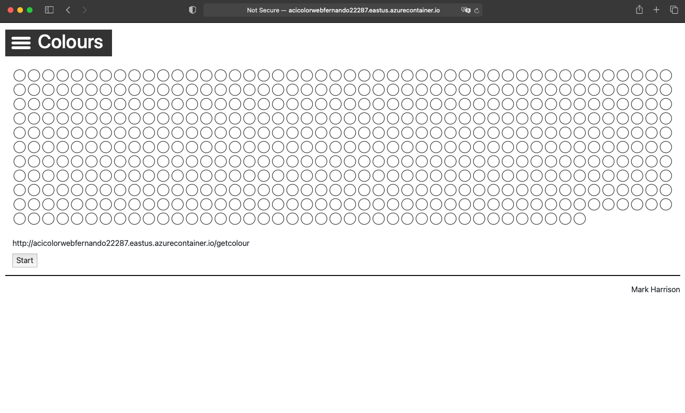
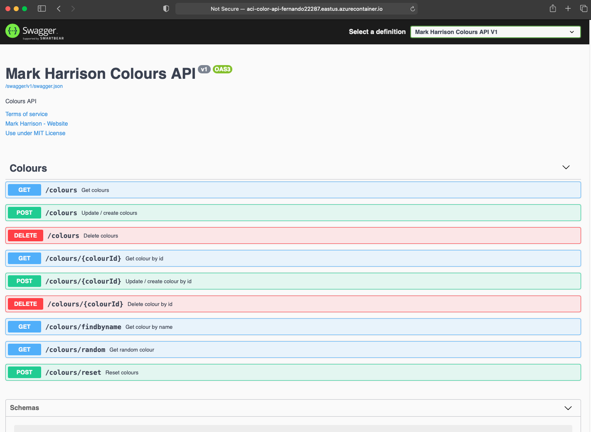

## Additional Topics - Provision your own instance of ColoursWeb/ColoursAPI

Some of the demos use the ColourWeb web application and the ColourAPI API application. In this lab we will show you how to deploy your own instances of the Colours Web and Colours API.  Note - ColoursWeb / ColoursAPI is new version of ColorsWeb/ColorsAPI  ... do not mix the web client and API versions. 

The code for the ColourWeb / ColourAPI applications is available here:

- [ColourWeb](https://github.com/markharrison/ColoursWeb)
- [ColourApi](https://github.com/markharrison/ColoursAPI)

Docker Containers exist for these applications and so provides an easy deployment option ( IMPORTANT : due to the new pull restrictions on Docker Hub images, in this lab we will be using the GitHub registry):

- Github (Colours)
  - docker pull ghcr.io/markharrison/coloursapi:latest
  - docker pull ghcr.io/markharrison/coloursweb:latest
- DockerHub (Colors)
  - docker pull markharrison/colorweb:latest
  - docker pull markharrison/colorapi:latest

With the container we can deploy to multiple hosting options : VM's, App Services, ACI and also AKS. In this lab we are going to show you how to do it with [Azure Container Instances](https://docs.microsoft.com/en-us/azure/container-instances/).


# Deploying Web and API containers with Azure Container Instances

1. Login to Azure Portal at http://portal.azure.com.
2. Open the Azure Cloud Shell and choose Bash Shell (do not choose Powershell)

   

3. The first time Cloud Shell is started will require you to create a storage account. 
4. We proceed to create a unique identifier suffix for resources created in this Lab:

    ```bash
    APIMLAB_UNIQUE_SUFFIX=$USER$RANDOM
    # Remove Underscores and Dashes
    APIMLAB_UNIQUE_SUFFIX="${APIMLAB_UNIQUE_SUFFIX//_}"
    APIMLAB_UNIQUE_SUFFIX="${APIMLAB_UNIQUE_SUFFIX//-}"
    # Check Unique Suffix Value (Should be No Underscores or Dashes)
    echo $APIMLAB_UNIQUE_SUFFIX
    # Persist for Later Sessions in Case of Timeout
    echo export APIMLAB_UNIQUE_SUFFIX=$APIMLAB_UNIQUE_SUFFIX >> ~/.bashrc
    ```

5. Now we proceed to create a resource group for our ACI objects:


    ```bash
    #we define some variables first
    APIMLAB_RGNAME=myColorsAppRg-$APIMLAB_UNIQUE_SUFFIX
    APIMLAB_LOCATION=eastus
    # Persist for Later Sessions in Case of Timeout
    echo export APIMLAB_RGNAME=$APIMLAB_RGNAME >> ~/.bashrc
    echo export APIMLAB_LOCATION=$APIMLAB_LOCATION >> ~/.bashrc

    #we create the resource group
    az group create --name $APIMLAB_RGNAME --location $APIMLAB_LOCATION
    ```

6.  Now we create our ACI and specify our colors-web github container
 
    ```bash
    #we define some variables first
    APIMLAB_COLORS_WEB=mycolorsweb-$APIMLAB_UNIQUE_SUFFIX
    APIMLAB_IMAGE_WEB=ghcr.io/markharrison/coloursweb:latest
    APIMLAB_DNSLABEL_WEB=acicolorweb$APIMLAB_UNIQUE_SUFFIX
    # Persist for Later Sessions in Case of Timeout
    echo export APIMLAB_COLORS_WEB=$APIMLAB_COLORS_WEB >> ~/.bashrc
    echo export APIMLAB_IMAGE_WEB=$APIMLAB_IMAGE_WEB >> ~/.bashrc
    echo export APIMLAB_DNSLABEL_WEB=$APIMLAB_DNSLABEL_WEB >> ~/.bashrc


    #we create the container instance for the colors web
    az container create --resource-group $APIMLAB_RGNAME --name $APIMLAB_COLORS_WEB --image $APIMLAB_IMAGE_WEB --dns-name-label $APIMLAB_DNSLABEL_WEB --ports 80 --restart-policy OnFailure --no-wait
    ```

7.   Now we run the following command to check the status of the deployment and get the FQDN to access the app:

      ```bash
      #we check the status
      az container show --resource-group $APIMLAB_RGNAME --name $APIMLAB_COLORS_WEB --query "{FQDN:ipAddress.fqdn,ProvisioningState:provisioningState}" --out table
      ```

      The output should something like this:

      ```
      FQDN                                                  ProvisioningState
      ----------------------------------------------------  -------------------
      aci-color-web-fernando22287.eastus.azurecontainer.io  Succeeded
      ```

      Once we have a "Succeeded" message we proceed to navigate to the FQDN. And we should see our home page for our Colours Web:

      

8.  Now we proceed to create the ACI for the colors-api github container:

    ```bash
    #we define some variables first
    APIMLAB_COLORS_API=mycolorsapi-$APIMLAB_UNIQUE_SUFFIX
    APIMLAB_IMAGE_API=ghcr.io/markharrison/coloursapi:latest
    APIMLAB_DNSLABEL_API=aci-color-api-$APIMLAB_UNIQUE_SUFFIX
    # Persist for Later Sessions in Case of Timeout
    echo export APIMLAB_COLORS_WEB=$APIMLAB_COLORS_WEB >> ~/.bashrc
    echo export APIMLAB_IMAGE_WEB=$APIMLAB_IMAGE_WEB >> ~/.bashrc
    echo export APIMLAB_DNSLABEL_WEB=$APIMLAB_DNSLABEL_WEB >> ~/.bashrc


    #we create the container instance for the colors api
    az container create --resource-group $APIMLAB_RGNAME --name $APIMLAB_COLORS_API --image $APIMLAB_IMAGE_API --dns-name-label $APIMLAB_DNSLABEL_API --ports 80 --restart-policy OnFailure --no-wait
    ```

9.  Now we run the following command to check the status of the deployment and get the FQDN to access the app:

    ```bash
    #we check the status
    az container show --resource-group $APIMLAB_RGNAME --name $APIMLAB_COLORS_API --query "{FQDN:ipAddress.fqdn,ProvisioningState:provisioningState}" --out table
    ```

    The output should something like this:

    ```
    FQDN                                                  ProvisioningState
    ----------------------------------------------------  -------------------
    aci-color-api-fernando22287.eastus.azurecontainer.io  Succeeded
    ```

    Once we have a "Succeeded" message we proceed to navigate to the FQDN. And we should see our home page (Swagger UI) for our Colours API:

    
