## Additional Topics - Self-hosted Gateway

With the API Management self-hosted gateway, organisations have the ability to deploy an instance of the APIM gateway component to the environments where they host their applications and/or APIs - for example, in an on-premise data center.

The self-hosted gateways are hosted in a Docker or Kuberenetes environment, and are managed from the API Management service they are connected to.

This part of the lab assumes that the user has Docker Desktop installed.  Installation instructions are [here](https://docs.docker.com/docker-for-windows/install/)

There are two terms to become familiar with:

- Gateway Deployment ... this is a set of APIM configuration details that will be used by the Gateway Node(s)
- Gateway Node ... this is a running instance of a APIM gateway proxy i.e. a containerised instance of the gateway

There can be multiple Gateway Deployments and multiple Gateway Nodes.  The Gateway Deployments are chargeable - the Gateway Nodes are free i.e. an organization pays for the management control plane, but the compute is free (you are running on the organizations own hardware)


## Deploy the Self-hosted Gateway

To deploy a self-hosted gateway:

- Select the `Gateways` option from the menu
- Select `+ Add`


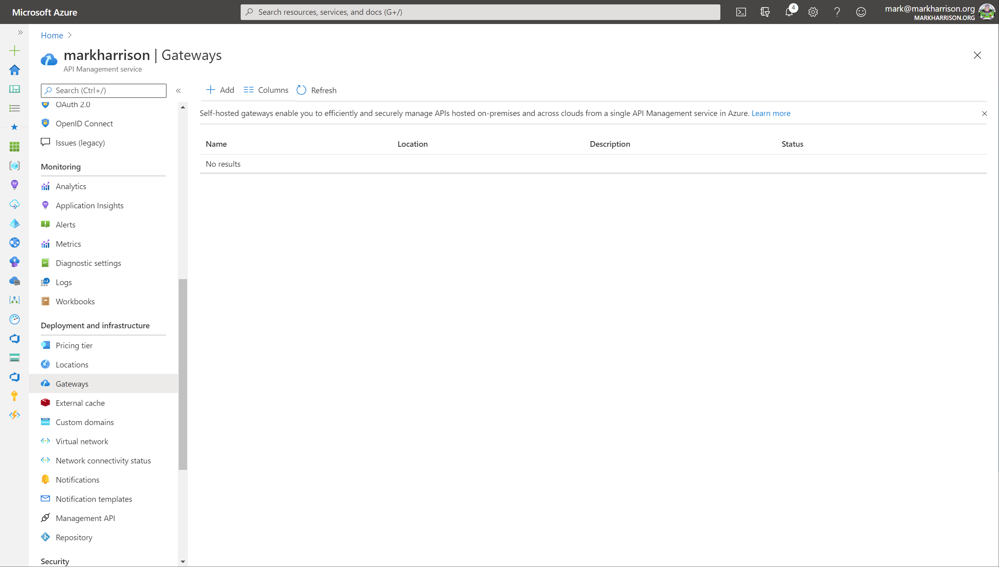

- Enter a Name and Location for the Gateway
- Select the required APIs from those that are configured in the APIM instance
  - Our lab will use the Color API - this was configured in an earlier module
- Select the `Add` button

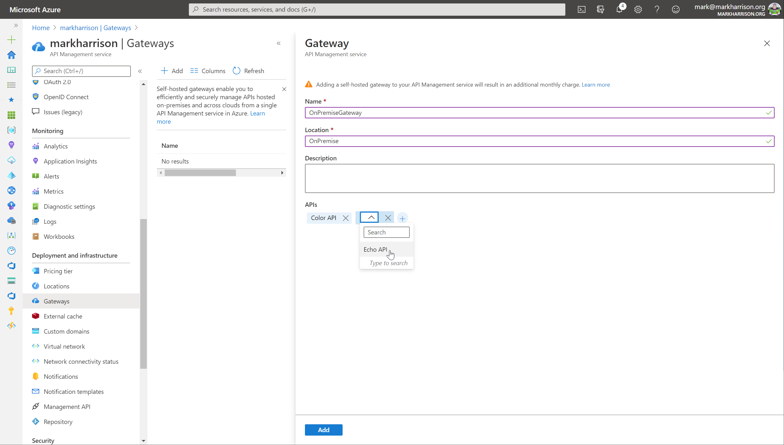

The added gateway will appear in the list ... this is the Gateway Deployment.


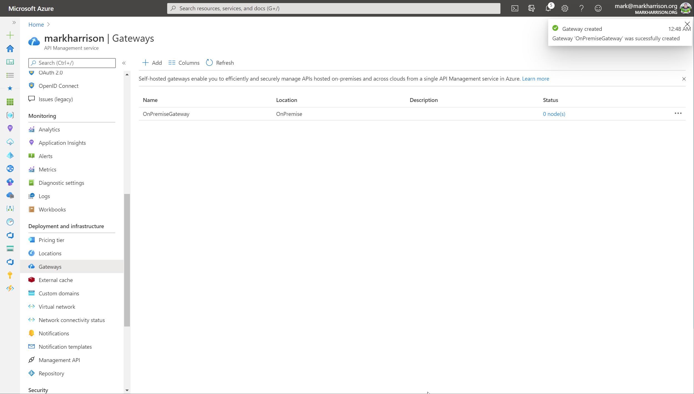

- Click on the gateway in the list - a blade appears allowing further configuration

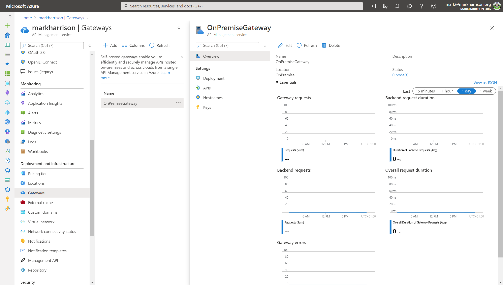

- Select the `Deployment` option from the menu
  - There are scripts for deploying on Docker and Kuberenetes ... for this lab, we will be using the Docker option
- Save the *env.conf* file to your desktop
- Copy the Docker run command but remove the *-d* parameter ... this is so the logs are displayed to the terminal

```text
docker run -p 80:8080 -p 443:8081 --name OnPremiseGateway --env-file env.conf mcr.microsoft.com/azure-api-management/gateway:latest
```

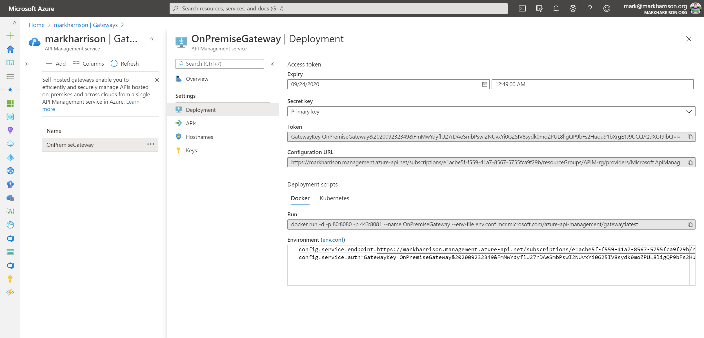

From a command line - elevated to Administrator (needed for Docker commands)

- Navigate to the location where the *env.conf* is located
- Run the Docker run command

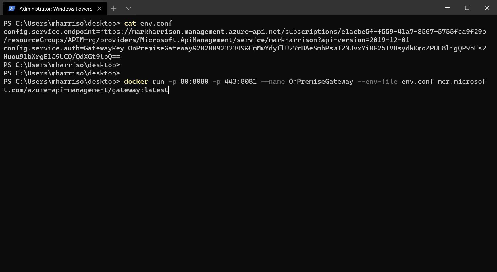

The first time this is executed, it will need to pull down the Docker image - and so there will be a small delay.  Subsequently - if restarted - it will just use the downloaded image.

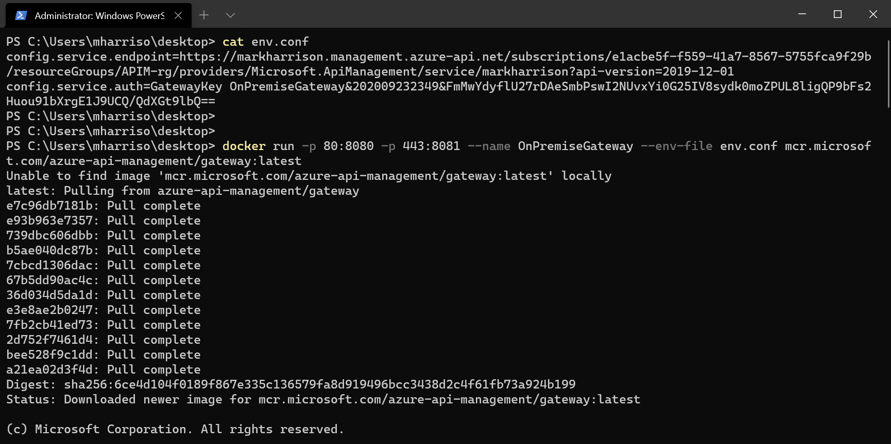

Once downloaded, the log output from the container will display a Sputnik logo (this was an internal code name) and some diagnostic logs.

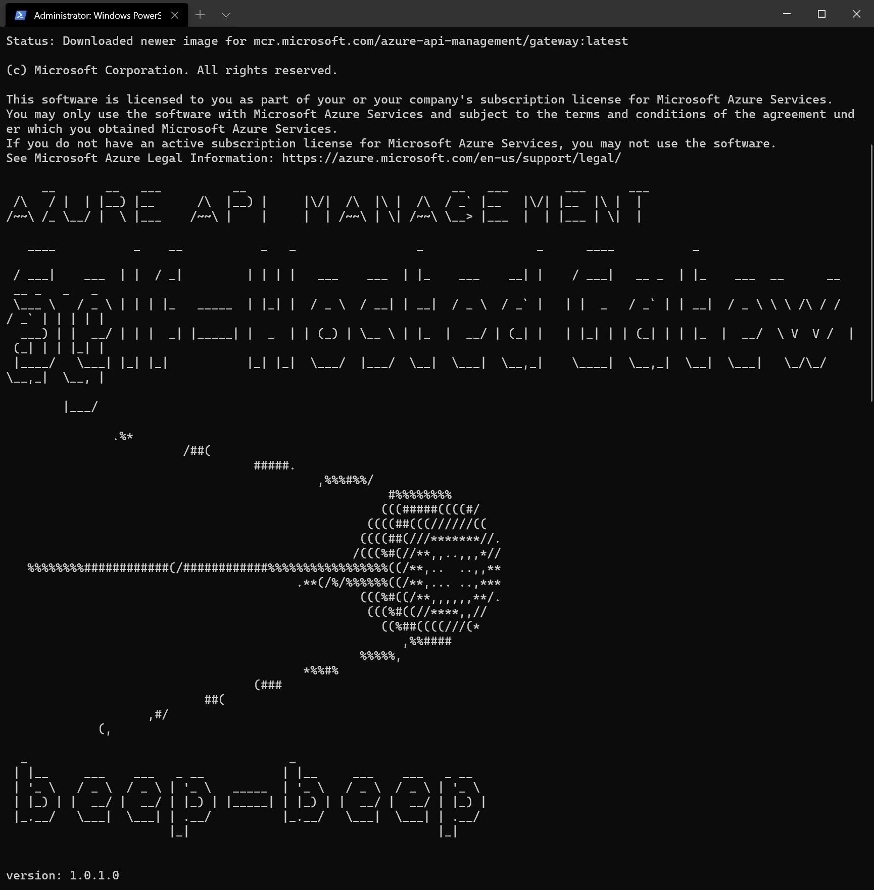


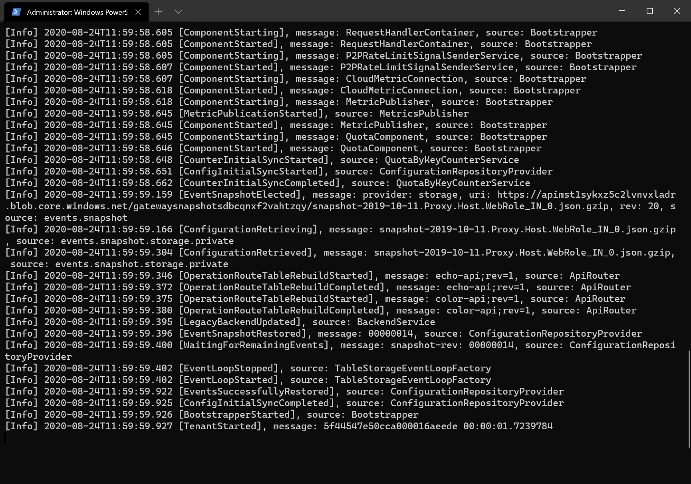

Note that in the Gateway blade we can see the status - it will show there is one healthy Gateway Node connected to the Deployment.   The Gateway Node will keep in sync, and be automatically updated should any of the Gateway Deployment config changes.

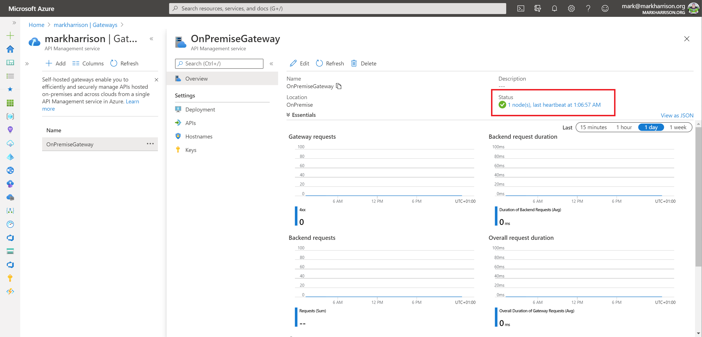

## Testing the API

Our Gateway Node is now deployed - and we can test that it works.

- Open Developer portal, go in the Profile page and get API key for Unlimited products
- Open Notepad - make note of URLs including the key.  For our lab test, the machine name is just *localhost*
  - https://localhost/color/api/RandomColor?key=Unlimited-Key

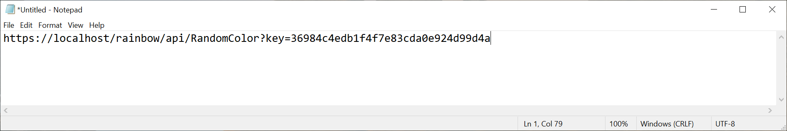

- Use a tool like [Postman](https://www.postman.com/) to test the API ... should see the random color appear in the response and this confirms everything is working properly
- If tested with a browser, then a warning needs to accepted to proceed - this is because trusted TLS certificates have not been set up

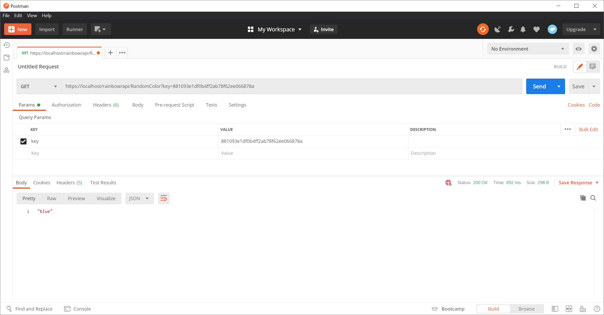

Diagnostics for the API call will be logged by the container.

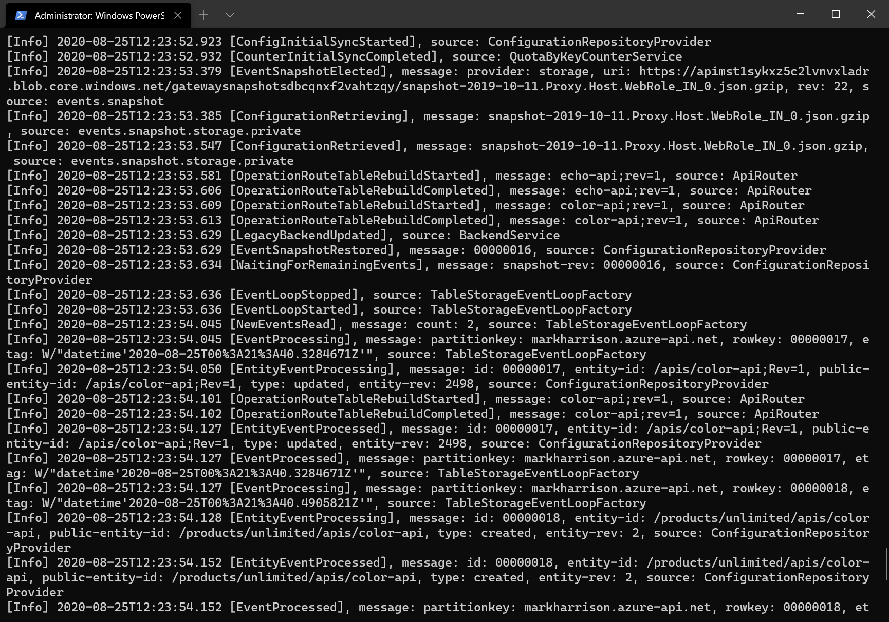


