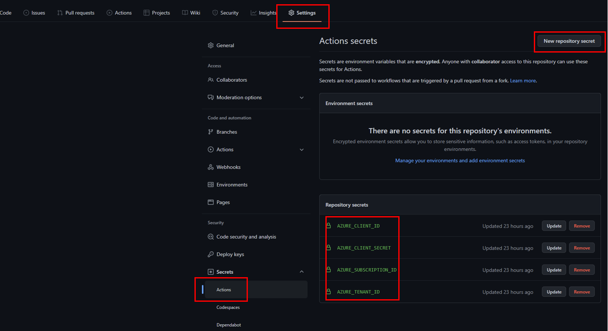

 
## Configure APIM tools in GitHub

1. Create a new Github repository. We will refer to it as **apiops** in this tutorial.
2. Copy the "code" and "utils" folder from the [**tools**](https://github.com/Azure/apiops/tree/main/tools) folder to the tools folder under this new repository (ignore the pipelines folder as its only relevant if you are using Azure DevOps). Copy the .github/worflows folder from the [**.github/workflows**](https://github.com/Azure/apiops/tree/main/.github/workflows) folder to .github/workflows folder under this new repository. Your folder structure should look like this:
    - your-repo-name
        - .github/workflows
            - ...
        - tools
            - code
                - ...
            - utils
3. Next we will need to [Create an Azure AD Service Principal](https://docs.microsoft.com/en-us/cli/azure/ad/sp?view=azure-cli-latest#az-ad-sp-create-for-rbac) and configure its access to Azure resources. We will provide the SP with the contributor role to the resource group hosting your APIM. Make sure that you have the [Azure CLI](https://docs.microsoft.com/en-us/cli/azure/install-azure-cli) installed. Issue the following command on your command prompt. Make sure you replace the subscription id and resource group with your own information:
    - az ad sp create-for-rbac -n "apiopslab" --role Contributor --scopes /subscriptions/{subscription-id}/{resource-group} --sdk-auth
    - The output of the above az cli command will be a json object as the one shown below. In the next step we will extract the four properties highlighted within the red box and and store them as secrets within your github repository. 
4.  Head to the settings menu in your Github repository and add the following secrets. Make sure to use the same names shown below as they will be referenced within the different workflows. 

5. Next head to the actions section within your repository and manually run the "Publish - Creator" and "Publish - Extractor" workflows. This will generate the binaires which will be utilized later on by the Extractor and Creator runners. You may see some unsucceful workflow runs in the workflow history, but you can ignore them for now. 

