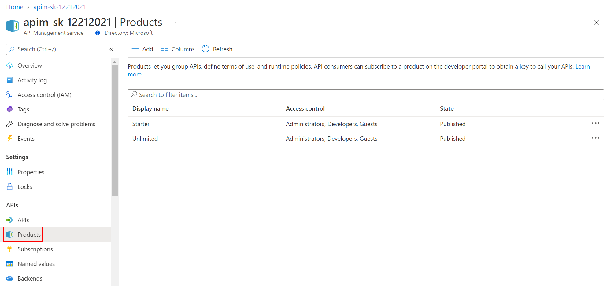
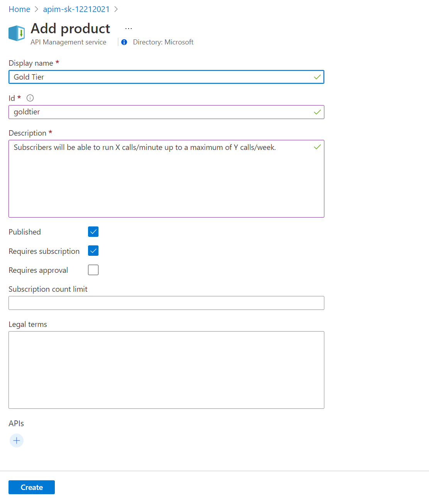
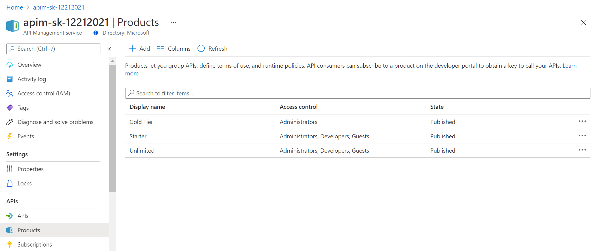
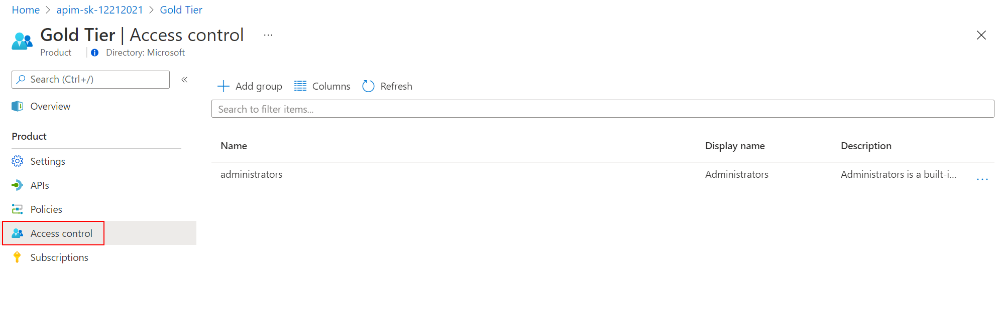
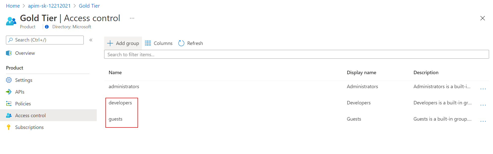

## Product Management

A product contains one or more APIs as well as a usage quota and the terms of use. Once a product is published, developers can subscribe to the product and begin to use the product's APIs.

### Product definition

- In the Azure Portal, open the resource menu item `Products`.

  

- Let's add a new product tier called `Gold Tier`. 

  

  

- Next, we'll change the access control by clicking on *Gold Tier* and selecting *Access control* in the left pane.

  

  Press *Add group*, check *Developers* and *Guests*, then press *Select*. The two added roles are shown now.

  

  Back in the private browsing session, browse to *Products* and observe the new *Gold Tier*. 

  