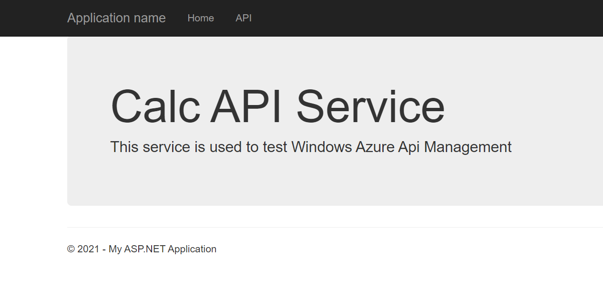
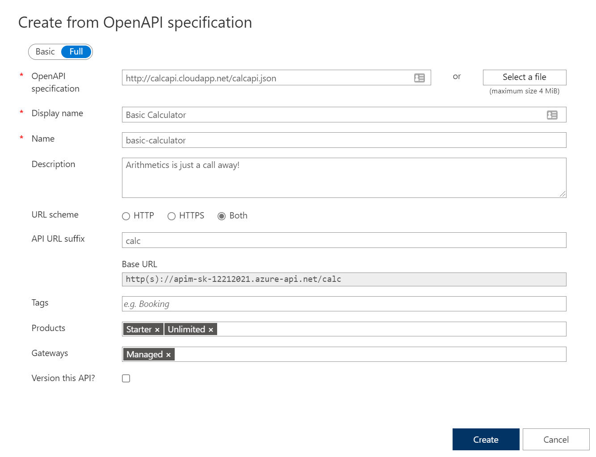
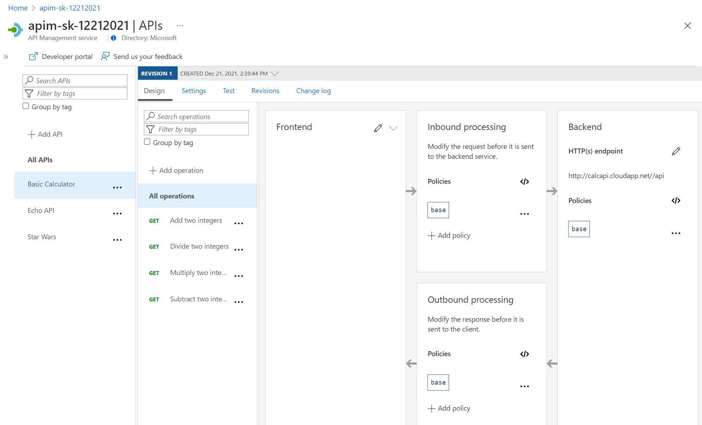
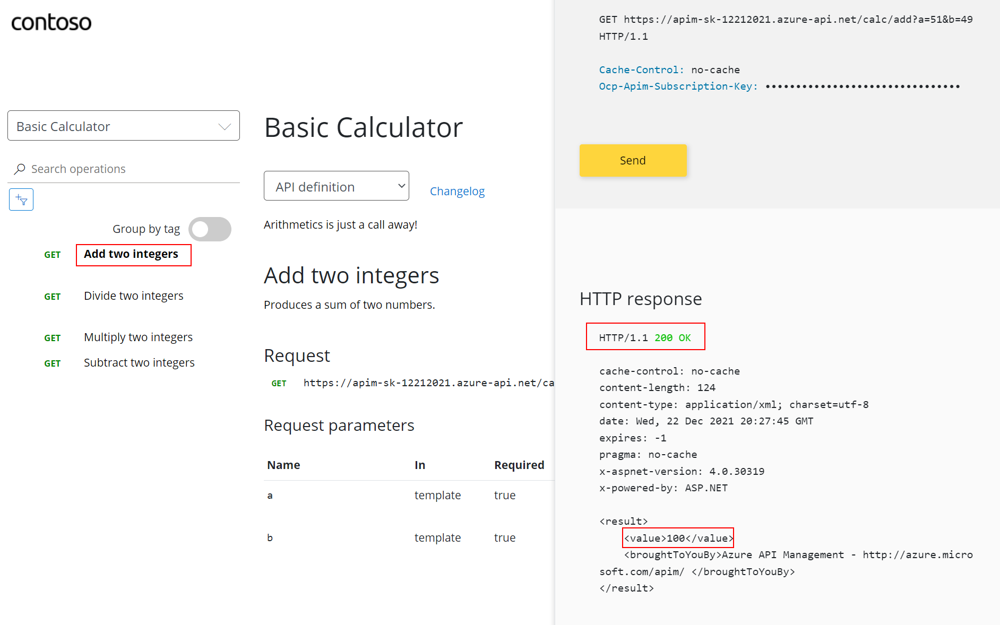
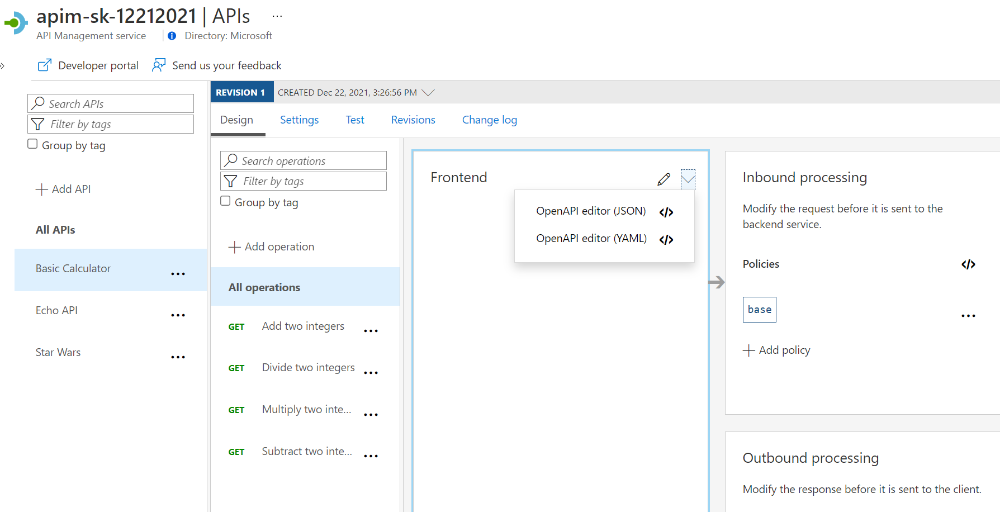
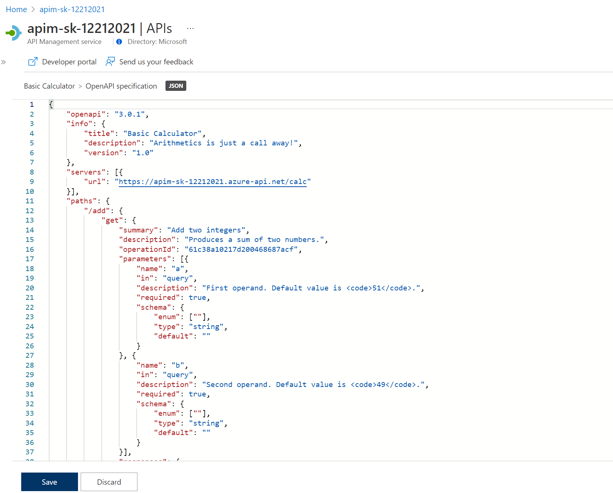
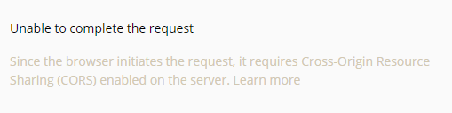

## Import API using OpenAPI

Instead of importing operations one-by-one, you can also import a full API. The [OpenAPI specification](https://www.openapis.org/) (aka [Swagger](https://swagger.io)) is a definition format to describe RESTful APIs. The specification creates a RESTful interface for easily developing and consuming an API by effectively mapping all the resources and operations associated with it.

As a demo we will use an API that offers a simple calculator service : [Calc API](http://calcapi.cloudapp.net/)

1) On the left menu, open the *APIs* blade.  
2) Under *Create from definition* select *OpenAPI*.  
3) Select the *Full* option in the *Create from OpenAPI specification* dialog.  
4) Enter `http://calcapi.cloudapp.net/calcapi.json` as the *OpenAPI specification* value. You should subsequently see *Display name*, *Name*, and *Description* populate.  
    > Note the intentional use of `http` instead of `https` as this backend does not presently support `https`.  
5) While the backend service only runs on `HTTP`, we need to **set URL scheme to `Both`** to allow for APIM ingress to occur on HTTPS for callers such as the Developer Portal.  
6) Set the *API URL suffix* to `calc`.  
7) Assign *Starter* and *Unlimited* products.  
8) Press **Create**.  

- Once the API is created, it will show in the list of APIs along with all of its operations.

  

- Back in the Developer Portal, try out the Calculator API via the *Add two integers* GET method, then examine the response.  
> Accepting the defaults of `49` and `51` suffices. There's presently an issue where defaults are shown in a dropdown. If you wanted to change the values, add new `a` and `b` parameters and values, then remove the dropdown values.

We can inspect / edit the Open API definition by selecting the *Edit* icon from the Frontend block:

---

## Troubleshooting

### Unable to complete the request

This is likely a mixed-content CORS error in which you are attempting a call to an APIM endpoint that is only set up for *HTTP*. It fails as the Developer Portal runs on *HTTPS*. Please check the setup steps above for the _URL scheme_.

