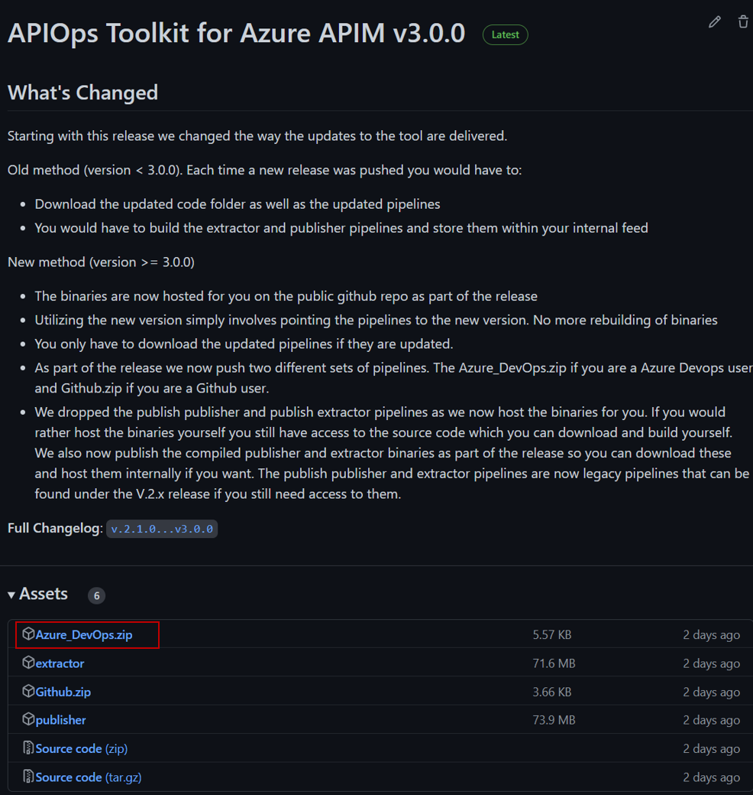
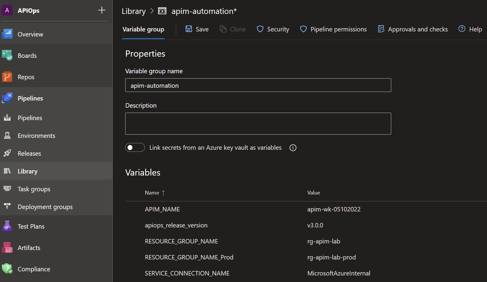

## Configure APIM tools in Azure DevOps

1. Create a new project in Azure DevOps. We will refer to it as **apiops** in this tutorial
2. Head to the release you are targeting on the Gihub page. The list of releases can be found [here](https://github.com/Azure/apiops/releases). For this example we will assume you are trying to start with release v.3.0.0.  As you can see in the image below under the "Assets" section you have a file called **Azure_DevOps.zip**. Download that file and then extract the content into your repository. Your folder structure should look like:
    - your-repo-name
        - tools
            - pipelines
                - ...
            - utils

    

3. [Create a pipeline variable group](https://docs.microsoft.com/en-us/azure/devops/pipelines/library/variable-groups?view=azure-devops&tabs=classic#create-a-variable-group) called **apim-automation**. In that group, add these variables:
    - **SERVICE_CONNECTION_NAME** and for its value, enter the name of your [Azure service connection](https://docs.microsoft.com/en-us/azure/devops/pipelines/library/service-endpoints?view=azure-devops&tabs=yaml).
    - **APIM_NAME** and for its value, enter the name of lower environment apim instance name. You can optionally enter the **APIM_NAME** the higher environment if you have that information ready or you can enter it at a later point.
    - **RESOURCE_GROUP_NAME** and for its value, enter the resource group name of your Azure APIM instance. In this example we have two apim instances representing both the dev and prod environments so make sure you have two resource group entries representing both as shown in the image below.
    - **apiops_release_version** and for its value, enter the release number you would like to utilize. For example if you would like to utilize version 3 then you would set the value to **"v3.0.0"**. Its always recommended to utilize the latest release when possible as it usually includes new features and bug fixes. 

4. Create a target [**environment**](https://docs.microsoft.com/en-us/azure/devops/pipelines/process/environments?view=azure-devops) called prod as shown below. The environment will allow us to require a manual approval between stages in a yaml based release pipeline. Choose Prod as the name and for the resource type choose None. 
5. After creating the environment add one ore more approvers by heading to the ellipses menu and click on "Approvals and checks" 
6. Here we are adding a single approver but in an enterprise setting its recommended that you add two or more approvers. 
7. Thats it. You are now ready to extract and publish your Azure APIM instance artifacts. For a list of supported artifacts refer to [this section ](https://azure.github.io/apiops/apiops/7-additionalTopics/apiops-7-3-supportedresources.html).