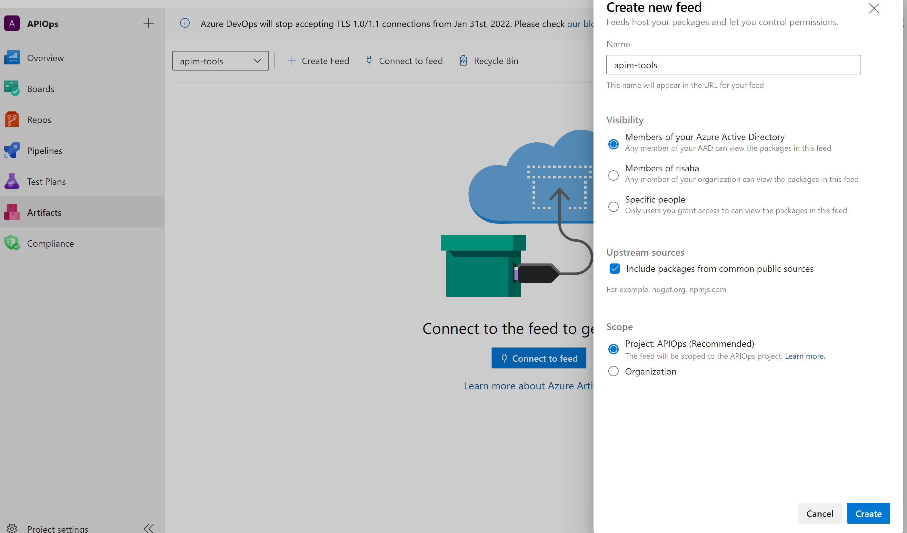
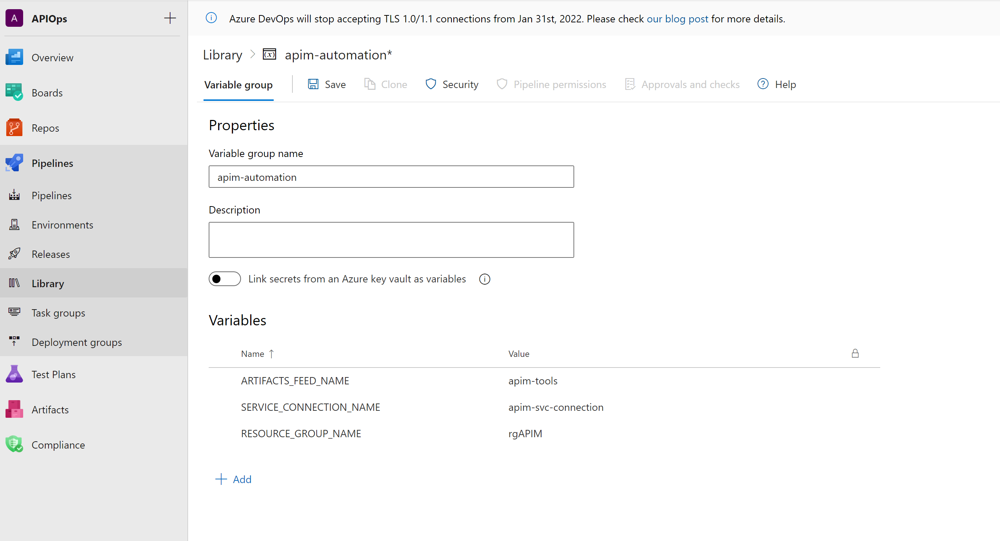
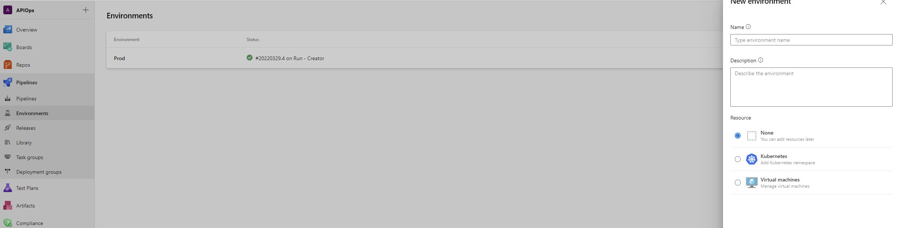
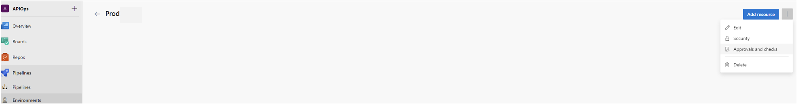
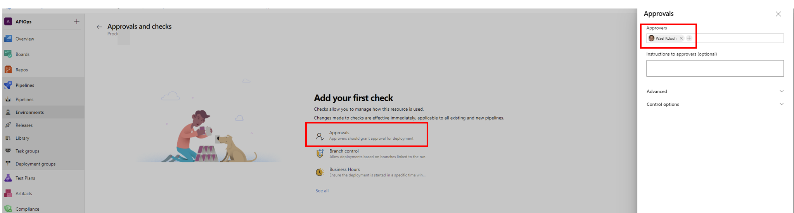
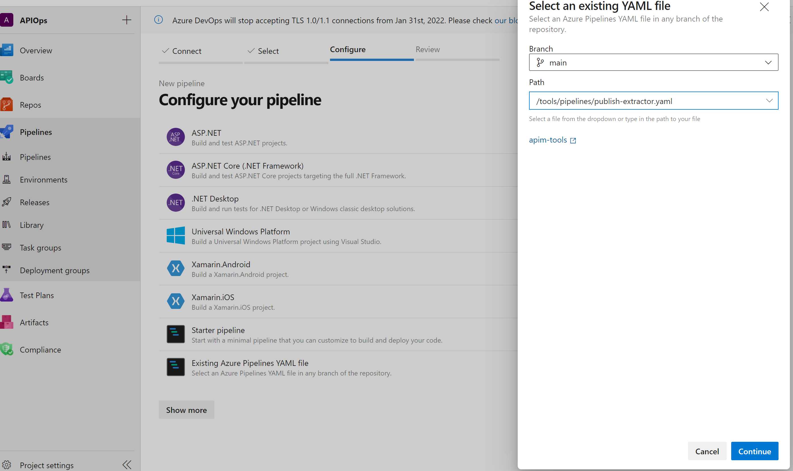

> **Warning**
> This section pertains to the older setup where it was required to download the code folder into your environment, run pipelines that build the code, and finally store the resulting binaries in your own environment. This is being retained for backward compatibility. Please use release V.3.0.0 or higher which utilizes the new method of consuming binaries that are now hosted on the Github repo and as a result there is no need to download the code folder anymore or the accompanying pipelines (publish-publisher and publish-extractor) into your environment.
 
The updated setup [can be found here](https://azure.github.io/apiops/apiops/3-apimTools/apimtools-azdo-2-3-new.html).

## Configure APIM tools in Azure DevOps - Old Version (< v.3.0.0)

1. Create a new project in Azure DevOps for this tutorial (optional). We will refer to it as **apiops** in this tutorial
2. Download the source code zipped folder for the release you are targeting. The list of releases can be found [here](https://github.com/Azure/apiops/releases)
3. Extract the following folders into this new repository. Your folder structure should look like:
    - your-repo-name
        - tools
            - code
                - ...
            - pipelines
                - ...
            - utils
4. [Create an Azure Artifacts feed](https://learn.microsoft.com/azure/devops/artifacts/concepts/feeds?view=azure-devops#create-a-feed). We will use the name **apim-tools** in this tutorial.

5. [Create a pipeline variable group](https://learn.microsoft.com/azure/devops/pipelines/library/variable-groups?view=azure-devops&tabs=classic#create-a-variable-group) called **apim-automation**. In that group, add these variables:
    - **ARTIFACTS_FEED_NAME** and for its value, enter the name of the artifacts feed you just created.
    - **SERVICE_CONNECTION_NAME** and for its value, enter the name of your [Azure service connection](https://learn.microsoft.com/azure/devops/pipelines/library/service-endpoints?view=azure-devops&tabs=yaml).
    - **APIM_NAME** and for its value, enter the name of lower environment apim instance name.
    - **RESOURCE_GROUP_NAME** and for its value, enter the resource group name of your Azure APIM instance. In this guide we have two apim instances representing both the dev and prod environments so make sure you have two resource group entries representing both as shown in the image below.

6. Create a target [**environment**](https://learn.microsoft.com/azure/devops/pipelines/process/environments?view=azure-devops) called prod as shown below. The environment will allow us to require a manual approval between stages in a yaml based release pipeline. Choose Prod as the name and for the resource type choose None. 
7. After creating the environment add one ore more approvers by heading to the ellipses menu and click on "Approvals and checks" 
8. Here we are adding a single approver but in an enterprise setting its recommended that you add two or more approvers. 
9. Create a new pipeline based on **publish-extractor.yaml**. This pipeline will compile the extractor tool whenever it's updated and publish it as a package in Azure DevOps Artifacts. Note that this file is found under the source code zipped folder under the release package that you have downloaded.

10. Run the pipeline. 
    >Note : By default Azure DevOps build pipeline agents don't have enough permissions to perform some actions that are required for our pipeline. 
    > 1. To contribute to a repo, create a branch or update a pr. You need to grant that permission as discussed [here](https://learn.microsoft.com/azure/devops/pipelines/policies/set-permissions?toc=%2Fazure%2Fdevops%2Forganizations%2Fsecurity%2Ftoc.json&bc=%2Fazure%2Fdevops%2Forganizations%2Fsecurity%2Fbreadcrumb%2Ftoc.json&view=azure-devops)
    > 2. To contribute to artifact feed. You need to grant that permissions (contributor) as discussed [here](https://learn.microsoft.com/en-us/azure/devops/artifacts/feeds/feed-permissions?view=azure-devops#configure-feed-settings)
11. Create a new pipeline based on **publish-publisher.yaml**. This pipeline will compile the publisher tool whenever it's updated and publish it as a package in Azure DevOps Artifacts.
12. Run the pipeline.