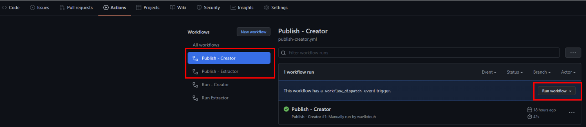

> **Warning**
> This section pertains to the older setup where it was required to download the code folder into your environment, run pipelines that build the code, and finally store the resulting binaries in your own environment. This is being retained for backward compatibility. Please use release V.3.0.0 or higher which utilizes the new method of consuming binaries that are now hosted on the Github repo and as a result there is no need to download the code folder anymore or the accompanying pipelines (publish-publisher and publish-extractor) into your environment.
 
The updated setup [can be found here](https://azure.github.io/apiops/apiops/3-apimTools/apimtools-github-2-4-new.html).
 
## Configure APIM tools in GitHub - Old Version (< v.3.0.0)

1. Create a new Github repository. We will refer to it as **apiops** in this tutorial.
2. Download the source code zipped folder for the release you are targeting. The list of releases can be found [here](https://github.com/Azure/apiops/releases)
3. Copy the "code" folder from the **tools** folder to the tools folder under this new repository. Copy the .github/worflows folder from the **.github/workflows** folder to .github/workflows folder under this new repository. Your folder structure should look like this:
    - your-repo-name
        - .github/workflows
            - ...
        - tools
            - code
4. Next we will need to [Create an Microsoft Entra ID service principal](https://learn.microsoft.com/cli/azure/ad/sp?view=azure-cli-latest#az-ad-sp-create-for-rbac) and configure its access to Azure resources. We will provide the SP with the contributor role to the resource groups hosting your different APIM instances. Make sure that you have the [Azure CLI](https://learn.microsoft.com/cli/azure/install-azure-cli) installed. Issue the following command twice on your command prompt (once for each environment). Make sure you replace the subscription id and resource group with your own information.
    - az ad sp create-for-rbac -n \"apiopslab\" \--role Contributor \--scopes /subscriptions/{subscription-id}/resourceGroups/{dev-resource-group} \--sdk-auth
    - az ad sp create-for-rbac -n \"apiopslab\" \--role Contributor \--scopes /subscriptions/{subscription-id}/resourceGroups/{prod-resource-group} \--sdk-auth
    - The output of the above az cli commands will be a json object as the one shown below. In the next step we will extract the four properties highlighted within the red box and and store them as secrets within each of your github repository environments. Note that for this guide we will create two Github [environments](https://docs.github.com/en/actions/deployment/targeting-different-environments/using-environments-for-deployment), but in an enterprise setting you will probably have more environments between dev and production (e.g. QA). 
5.  To create an environment you will need to head to the settings menu in your Github repository and crete an environment called dev. Then add 6 secrets (4 from the command you issued above in addition to the apim instance name and resource group). Make sure to use the same names shown below as they will be referenced within the different workflows. 
6. Repeat the same process for the production apim instance (remember to use the information from the json object generated for the production apim instance in the service principal command above). Also for hte production environment we will need to add a protection rule to ensure that the production stage only gets triggered after manual approval. Here is the completed production environment settings with one reviewer selected. Its recommended you have at least two approvers in an enterpirse setting. 
7. Here are the two completed environments: 

8. Next head to the actions section within your repository and manually run the "Publish - Publisher" and "Publish - Extractor" workflows. This will generate the binaires which will be utilized later on by the Extractor and Publisher runners. 
    >Note that Github build pipeline agents don't have permission by default to contribute to a repo, create a branch or update a pr. Set the security settings to allow Workflows to have write permissions.
You need to grant that permission as discussed [here](https://docs.github.com/en/repositories/managing-your-repositorys-settings-and-features/enabling-features-for-your-repository/managing-github-actions-settings-for-a-repository#setting-the-permissions-of-the-github_token-for-your-repository)
