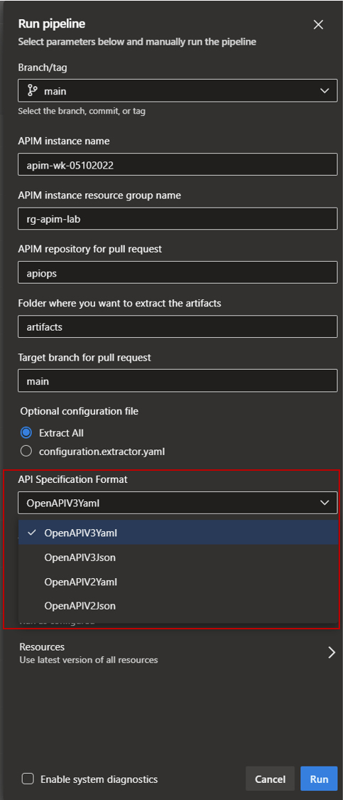
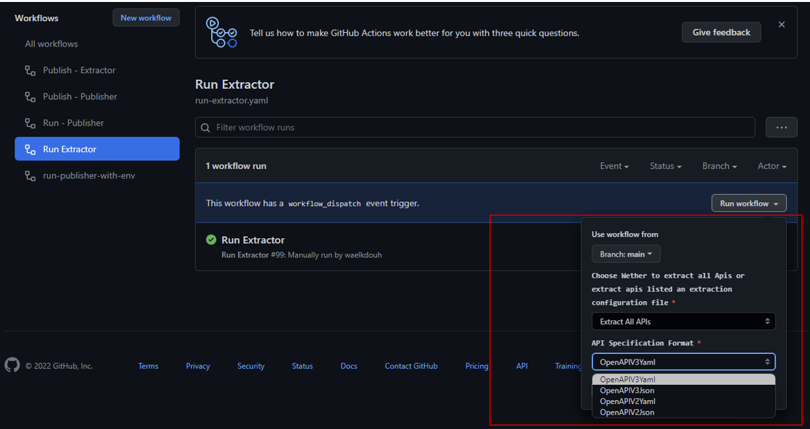

This section describes the extractor component which forms the core tool used to extract artifacts from Azure APIM using APIOps.

## Extractor
The extractor generates APIOps artifacts from an existing APIM instance. These artifacts can then be used as the source of truth for your APIM environment; make changes to them and have a CI/CD process update your Azure environment (with the publisher tool, for instance).

### Parameters
The tool expects certain configuration parameters. These can be passed as environment variables, command line arguments, etc. It will look for variables using the [``Host.CreateDefaultBuilder(arguments)``](https://docs.microsoft.com/en-us/dotnet/api/microsoft.extensions.hosting.host.createdefaultbuilder?view=dotnet-plat-ext-6.0#Microsoft_Extensions_Hosting_Host_CreateDefaultBuilder_System_String___) settings. Here are the expected parameters:

| Variable | Purpose |
| - | - |
| AZURE_SUBSCRIPTION_ID | Subscription ID of the APIM instance to be extracted |
| AZURE_RESOURCE_GROUP_NAME | Resource group name of the APIM instance to be extracted |
| AZURE_BEARER_TOKEN | Token for authentication to Azure. If this is not specified, the tool authenticate with  the [``DefaultAzureCredential``](https://docs.microsoft.com/en-us/dotnet/api/azure.identity.defaultazurecredential?view=azure-dotnet). |
| API_MANAGEMENT_SERVICE_NAME | Name of the APIM instance to be extracted |
| API_MANAGEMENT_SERVICE_OUTPUT_FOLDER_PATH | Folder where the APIM artifacts will be saved |
| API_SPECIFICATION_FORMAT | OpenAPI specification format. Valid options are **JSON** or **YAML**. If the variable is missing or invalid, **YAML** will be used by default |
| CONFIGURATION_YAML_PATH | Path to the Yaml configuration file used to specify select apis to extract. A sample yaml extractor configuration file to signal to the extractor to extract select apis. This is an optional parameter and will only come into play if you want different teams to manage different apis. You typically will have one configuration per team. Note: You can call the file whatever you want as long as you reference the right file within your extractor pipeline.
| AZURE_CLOUD_ENVIRONMENT | Azure Authority Host Service url that will be used. This is a optional parameter and will default to **AzurePublicCloud** if not specified. 
| Logging__LogLevel__Default:  | The allowed values are either "Information", "Debug", or "Trace". Table below shows the description of each logging level.

Here are the different logging levels available. By default the logging level is set to "Information". 

| Log Level | Description |
| - | - |
| Information | Logs that track the general flow of the application. These logs should have long-term value |
| Debug | Logs that are used for interactive investigation during development. These logs should primarily contain information useful for debugging and have no long-term value |
| Trace | Logs that contain the most detailed messages. These messages may contain sensitive application data. These messages are disabled by default and should never be enabled in a production environment |

### API_SPECIFICATION_FORMAT
The specification file format is controlled by the configuration variable ``API_SPECIFICATION_FORMAT``. Here are the options:

| Configuration value | Action |
|-|-|
| Not specified | Use OpenAPI v3 YAML |
| Json | Use OpenAPI v3 JSON (for backward compatibility. Use OpenAPIV3Json instead ) |
| Yaml | Use OpenAPI v3 YAML (for backward compatibility. Use OpenAPIV3Yaml instead ) |
| OpenAPIV2Json | Use OpenAPI v2 JSON |
| OpenAPIV2Yaml | Use OpenAPI v2 YAML |
| OpenAPIV3Json | Use OpenAPI v3 JSON |
| OpenAPIV3Yaml | Use OpenAPI v3 YAML |

The configuration values are case-insensitive. 

>APIM doesn't support OpenAPI v2 YAML. If you want to extract OpenAPI v2 YAML, the extractor extracts in JSON and converts to YAML. For publishing, the tool converts the YAML to JSON and pushes it.

The figures below demonstrates specifying the the openapi specification format in both Azure Devops and Github Actions.

### AZURE_CLOUD_ENVIRONMENT
The Azure Authority Host Service url is controlled by the configuration variable ``AZURE_CLOUD_ENVIRONMENT``. Here are the options:

| Value | Url
| - | - |
| AzurePublicCloud | https://management.azure.com/ |
| AzureChinaCloud | https://management.chinacloudapi.cn/ |
| AzureGermanCloud | https://management.microsoftazure.de/ |
| AzureUSGovernment | https://management.usgovcloudapi.net/ |

### Artifacts
The extractor will export the artifacts listed below.
> Note that all artifacts gets exported in parallel. We use retry up to 10 times with exponential backoff in case Azure throttles the requests, but keep this in mind in case you have many APIs/operations and experience IO issues.

| Type | Path |
| - | - |
| APIM instance global policy | ./policy.xml |
| Product information | ./products/``product_display_name``/productInformation.json |
| Product Groups | ./products/``product_display_name``/policy.xml |
| Product Groups | ./products/``product_display_name``/groups.json. Please note that we don't create the groups. We only associate with existing ones that would be created using IaC tool like ARM/Bicep/Terraform which is outside the scope of this tool |
| Gateway information | ./gateways/``gateway_name``/gatewayInformation.json |
| Authorization server information | ./authorizationServers/``authorization_server_name``/authorizationServerInformation.json |
| Diagnostic information | ./diagnostics/``diagnostic_name``/diagnosticInformation.json |
| Logger information | ./loggers/``logger_name``/loggerInformation.json |
| Non Versioned/revisioned API information | ./apis/``api_name``/Original/1/apiInformation.json |
| Non Versioned/revisioned specification information | ./apis/``api_name``/Original/1/specification.yaml |
| Versioned API information | ./apis/``api_name``/``Original serves as v1 in addition to folders for each version``/1/apiInformation.json |
| Versioned specification information | ./apis/``api_name``/``Original serves as v1 in addition to folders for each version``/1/specification.yaml |
| revisioned API information | ./apis/``api_name``/``Original\[revision number]``/apiinformation.json |
| revisioned specification information | ./apis/``api_name``/``Original\[revision number]``/specification.yaml |
| OpenAPI specification | ./apis/``api_name``/specification.{yaml\|json} |
| API policy | ./apis/``api_name``/policy.xml |
| Operation policy | ./apis/``api_name``/operations/``operation_name``/policy.xml |
| tags | ./tags/``tag_name``
| backends | ./backends/``backend_name``
