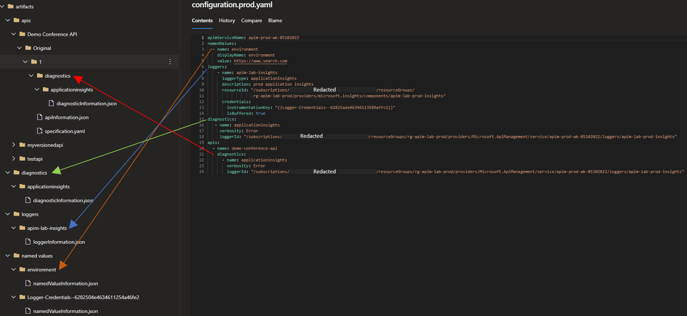
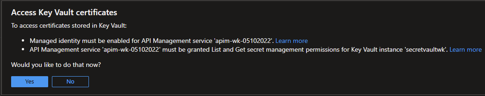

This section describes the Publisher component which forms the core tool used to publish the updates to the Azure APIM instance.

## Publisher
The Publisher tool updates the Azure APIM instance with the artifact folder contents. If a commit ID is specified in the parameters, it will update the instance with only files that were changed by the commit. In addition, the publisher tool picks up changes in the configuration yaml file when running the publisher. The configuration file is the only file outside of the artifacts folder that gets picked up by the publisher tool when promoting changes across environments.
### Parameters
The tool expects certain configuration parameters. These can be passed as environment variables, command line arguments, etc. It will look for variables using the [``Host.CreateDefaultBuilder(arguments)``](https://learn.microsoft.com/dotnet/api/microsoft.extensions.hosting.host.createdefaultbuilder?view=dotnet-plat-ext-6.0#Microsoft_Extensions_Hosting_Host_CreateDefaultBuilder_System_String___) settings. Here are the expected parameters:

| Variable | Purpose |
| - | - |
| AZURE_SUBSCRIPTION_ID | Subscription ID of the APIM instance to be updated |
| AZURE_RESOURCE_GROUP_NAME | Resource group name of the APIM instance to be updated |
| API_MANAGEMENT_SERVICE_OUTPUT_FOLDER_PATH | Folder where the APIM artifacts are located |
| AZURE_BEARER_TOKEN | Token for authentication to Azure. If this is not specified, the tool authenticate with  the [``DefaultAzureCredential``](https://learn.microsoft.com/dotnet/api/azure.identity.defaultazurecredential?view=azure-dotnet) |
| API_MANAGEMENT_SERVICE_NAME  | Name of the APIM instance to publish to. This can also be parsed from the configuration file |
| ARM_API_VERSION | Azure ARM API version that will be used. This is a optional parameter and will default to **2022-04-01-preview** if not specified. Other versions can be found here [APIM Rest API Reference - Overview Docs](https://learn.microsoft.com/en-us/rest/api/apimanagement/current-ga/api-diagnostic/create-or-update?tabs=HTTP). 
| CONFIGURATION_YAML_PATH | Path to the Yaml configuration file used to override different configurations (e.g. policy backend value,  namevalue pairs, just to name a few) when promoting across APIM environments (e.g. dev -> qa -> prod). You will need a unique Yaml configuration file per environment  (e.g. configuration.prod.yaml for production) when overriding configurations across environments. The configuration file is not mandatory. If you don't provide it, the overrides will be picked from the environment variables as discussed in the wiki [here](https://github.com/Azure/apiops/wiki/Configuration#configuration-providers). Remember that you always need to provide the apimServiceName at a minimum which informs the publisher about the destination apim instance |
| AZURE_CLOUD_ENVIRONMENT | Azure Authority Host Service url that will be used. This is a optional parameter and will default to **AzurePublicCloud** if not specified. 
| COMMIT_ID | Git commit ID. If specified, the tool will only use files that were affected by that commit. New/modified files will be updated in Azure, and deleted artifacts will be removed from the Azure APIM instance. If unspecified, the tool will do a Put operation on the Azure APIM instance with all files in the artifacts folder |
| Logging__LogLevel__Default:  | The allowed values are either "Information", "Debug", or "Trace". Table below shows the description of each logging level.

Here are the different logging levels available. By default the logging level is set to "Information". 

| Log Level | Description |
| - | - |
| Information | Logs that track the general flow of the application. These logs should have long-term value |
| Debug | Logs that are used for interactive investigation during development. These logs should primarily contain information useful for debugging and have no long-term value |
| Trace | Logs that contain the most detailed messages. These messages may contain sensitive application data. These messages are disabled by default and should never be enabled in a production environment |


>There are some interesting interactions with cases where we pass a commit ID. Here's the current behavior:

| COMMIT_ID specified | Action |
| - | - |
| No | Put all files in the artifacts directory |
| Yes | Put artifacts that have changed in commit. Also include all artifacts defined in configuration (configuration YAML, environment variables, etc) that exist in the artifacts directory |

### Configuration Override Across Environments
 In an enterprise setting you may want to override some configurations as you promote your APIM across environments. For example you may have a policy which points to a backend url which is different across environments. Or you may be using a completely different application insights instance across environments and you would like to point to the correct application insights instance. In order to override these configurations you will need to provide them inside a environment specific configuration file which the publisher tool can pick up and parse when pushing the changes across different APIM instances. For example if you have three different environments (Dev -> QA -> Prod) then you would have two separate configuration files (e.g. configuration.qa.yaml and configuration.prod.yaml). The lowest environment doesn't require a configuration file as its the source environment.
 
Here is a [**sample configuration file**](https://github.com/Azure/apiops/blob/main/configuration.prod.yaml). The image below shows how the aforementioned sample configuration file maps to the generated artifacts.



 
Note that the configuration file is optional. For a full list of supported configuration overrides that the publisher tool supports please take a look at the restful api documentation of APIM which can be found here [**APIM Restful API Docs**](https://learn.microsoft.com/en-us/rest/api/apimanagement/current-ga/apis/create-or-update?tabs=HTTP). For more information spend some time looking at the response body of each of the sections in the APIM docs. Here is an example of the [**API Diagnostics Response Body which shows you which properties you can override**](https://learn.microsoft.com/en-us/rest/api/apimanagement/current-ga/api-diagnostic/create-or-update?tabs=HTTP#apimanagementcreateapidiagnostic).


```
Note: When it comes to child configuration override (e.g. apis diagnostics) you don't need to include the properties tag in your yaml. 
```

The publisher supports overriding secret named values. Whereas the publisher supports both types of APIM secrets (secret and Azure Key Vault), we recommend using Azure Key Vault whenever possible. 

If you are trying to override a secret stored in Azure Key Vault then you can simply override the named value in your configuration file as demonstrated in the following [**sample configuration file**](https://github.com/Azure/apiops/blob/main/configuration.prod.yaml).

Also when using Key vault make sure you complete the steps below. You can either carry them ahead of time or at the time of creating the Key Vault named value within your APIM instance. You need to carry the steps below on every APIM instance (QA, PROD, etc.) to which you will be promoting to as infrastructure activities are outside the scope of the APIOPS tool.





```
Note: You don't have to create the named values in the target APIM environments ahead of time as they will be created by the publisher.
```

If you are trying to override a secret stored as secret namedvalue type in APIM you can simply override the named value in your configuration file as demonstrated in the following [**sample configuration file**](https://github.com/Azure/apiops/blob/main/configuration.prod.yaml).

The important thing to note here is that the value included in the configuration override needs to be defined as a secret in your Azure Devops (as a variable group secret) and Github (as an environment secret) and then passed as an environment variable in the yaml files. The sample configuration yaml files provided in this repository set a variable name called testSecretValue which is the value that gets set on Azure APIM. Another thing to note here is that there is that you need to surround your secret with {#[your secret]#}. Set the list of environments variables as you fit for your scenario. 

```
Note: You will need to install the Replace Tokens Extension in the Azure DevOps environment. Go to the marketplace and search for Replace Tokens. You don't need to install any extension for Github as its not required there.
```

```
Note: You don't have to create the named values in the target APIM environments ahead of time as they will be created by the publisher.
```

```
Note: Important note regarding deleting apis. If you delete the specification file nothing happens. But if you delete the information file we delete the api. Now if you delete one but not the other it will do a put of whichever file is left. So always make sure you delete both files when deleting an api. As a matter of fact its recommended you delete the folder pertaining to the api under question.
```
