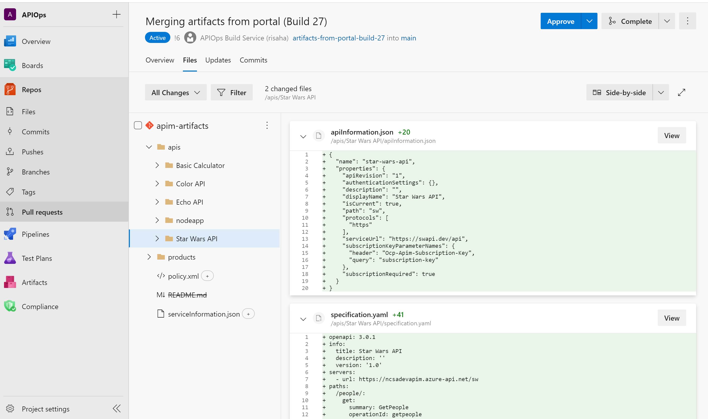

## Create APIM artifacts in Azure DevOps from extractor tool

1. Make sure the Azure DevOps service principal has read access to your Azure APIM instance.
2. Create a new pipeline based on [**run-extractor.yaml**](https://github.com/Azure/apiops/tree/main/tools/pipelines/run-extractor.yaml) in your repository.
3. Run the pipeline. When prompted for parameters, specify the instance name, resource group name, the APIM artifacts repository name, folder where the artifacts will be extracted to, and the main branch where artifacts will live. The pipeline will use the extractor tool to download instance artifacts, then it will create a pull request to the main branch of your APIM artifacts repository.
> If this is your first time running this pipeline, you may be prompted to [authorize access](https://docs.microsoft.com/en-us/azure/devops/pipelines/repos/multi-repo-checkout?view=azure-devops#why-am-i-am-prompted-to-authorize-resources-the-first-time-i-try-to-check-out-a-different-repository) to the **apim-tools** repository.
4. Under **Pull requests** -> **Active**, you should see a new pull request with the extracted artifacts. Don't merge the Pull Request yet as we still need to configure the Run-Creator.yml file in the next section before we merge.

You can always rerun the pipeline to refresh your repository with the latest Azure changes. Now that we have artifacts in our repository, let's create a pipeline to push changes back to Azure.
