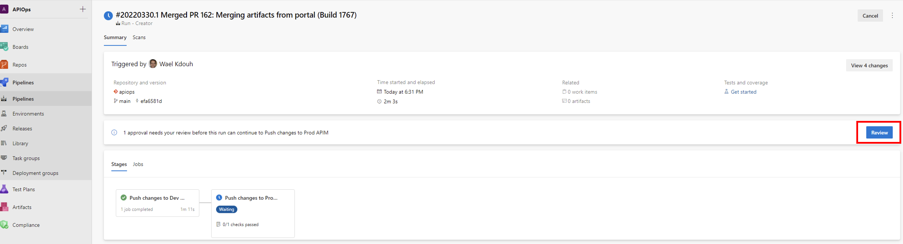
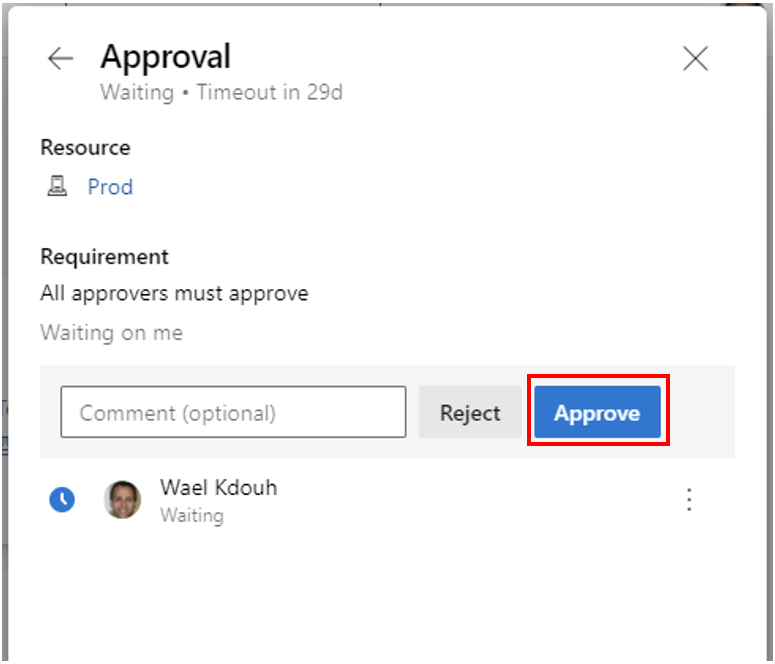

### Create pipeline to automatically push changes using creator tool

1. Create a new pipeline based on [**run-creator.yaml**](https://github.com/Azure/apiops/tree/main/tools/pipelines/run-creator.yaml) in your  repository.
> If this is your first time running this pipeline, you may be prompted to [authorize access](https://docs.microsoft.com/en-us/azure/devops/pipelines/repos/multi-repo-checkout?view=azure-devops#why-am-i-am-prompted-to-authorize-resources-the-first-time-i-try-to-check-out-a-different-repository) to the **apim-tools** repository.
2. Go back to the PR that was created in the previous step as a result of running the extractor. Once the PR is merged the run-creator pipeline should automatically trigger. Remember that the creator pipeline requires manual approval before promoting between stages. To promote to the prod environment, wait on the dev stage to succeed and then click on the review button and approve to deploy the changes to the prod environment.
 
3. Approve the prod environment for deployement. 

