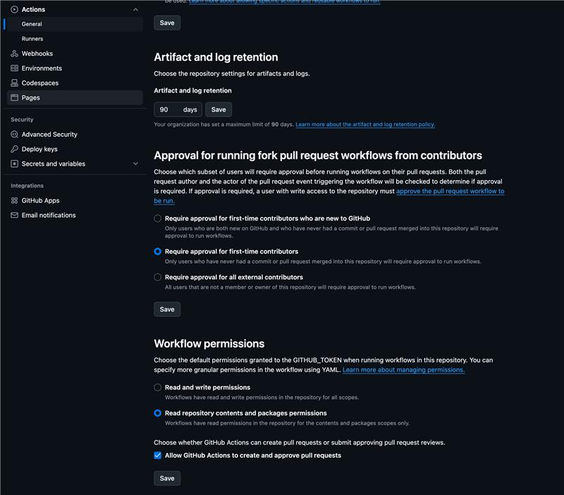
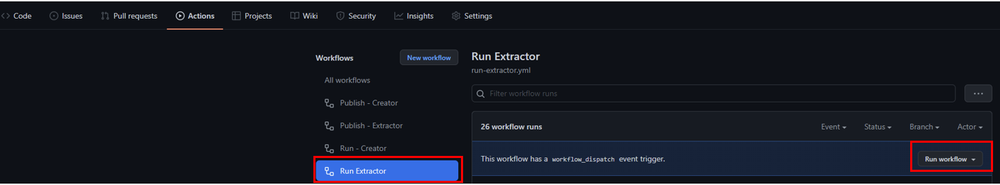

## Extract APIM artifacts in GitHub from extractor tool

The extractor tool will be required under Scenario A (Users Who Build APIs Using the Azure Portal). Under Scenario B you don't need to utilize the extractor tool to generate the artifacts as the artifacts will be created in the IDE. Having said that, nothing prevents you from utilizing the extractor tool to generate the initial artifacts if you are introducing the tool to an existing APIM instance.

1. Before you run the extractor for the first time the GH Actions bot needs "read and write permissions" as well as the checked "Allow GitHub Actions to create and approve pull requests". These settings can be found under the settings section within your repository. 
2. Head to the actions section within your repository and manually run the  "Run - Extractor" workflow. 

3. Under **Pull requests** section on your github repo, you should see a new pull request with the extracted artifacts. **Don't merge the Pull Request yet** as we still need to configure the Run-Publisher.yaml file in the next section before we merge. You can always rerun the pipeline to refresh your repository with the latest Azure changes.
 
    

