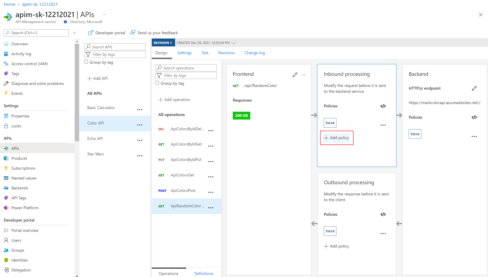
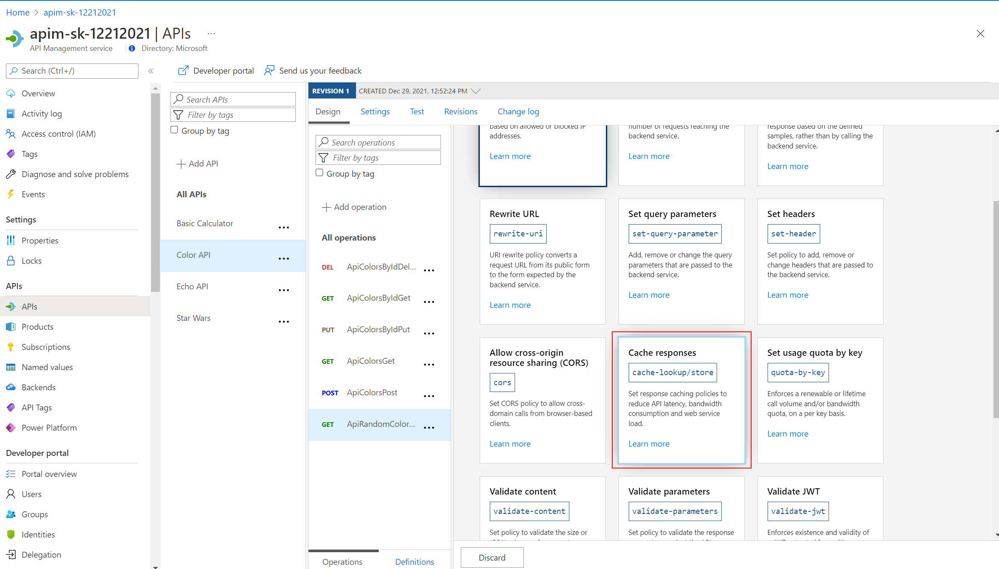
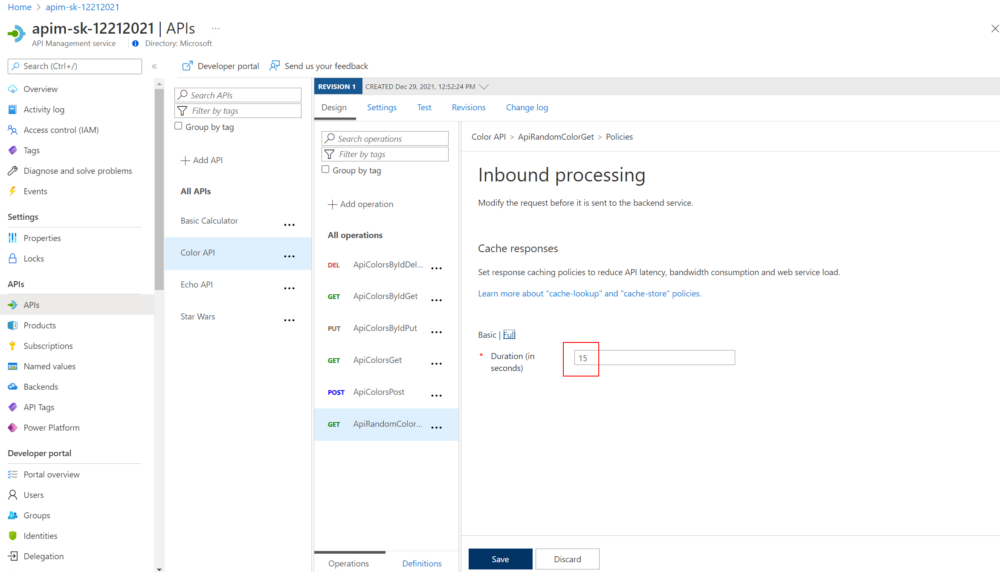

### Caching

API Management can be configured for response caching which can significantly reduce API latency, bandwidth consumption, and web service load for data that does not change frequently.

Using the Azure Management portal, navigate to the *Color* API and set a set a caching policy for the `ApiRandomColor` GET:
  - Press *Add policy*.

    

  - Select *Cache responses*.

    

  - Set a caching duration of `15` seconds.
    > Simple caching configuration is not yet implemented in the Azure Management portal. We shall see later how it can be done using policy expressions.

    

- Configure the Color website from lab 3 to use the Unlimited subscription URL.
- Select *Start*.
- Notice that for each 15 second period the same color is set.

  

- Looking at the *ApiRandomColor* GET API policies in the *Code View*, you'll see the caching policy defined:

  ```xml
  <policies>
      <inbound>
          <base />
          <cache-lookup vary-by-developer="false" vary-by-developer-groups="false" downstream-caching-type="none" />
      </inbound>
      <backend>
          <base />
      </backend>
      <outbound>
          <base />
          <cache-store duration="15" />
      </outbound>
      <on-error>
          <base />
      </on-error>
  </policies>
  ```