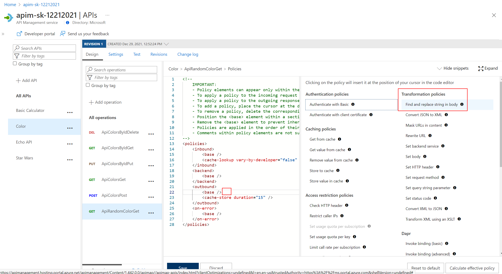
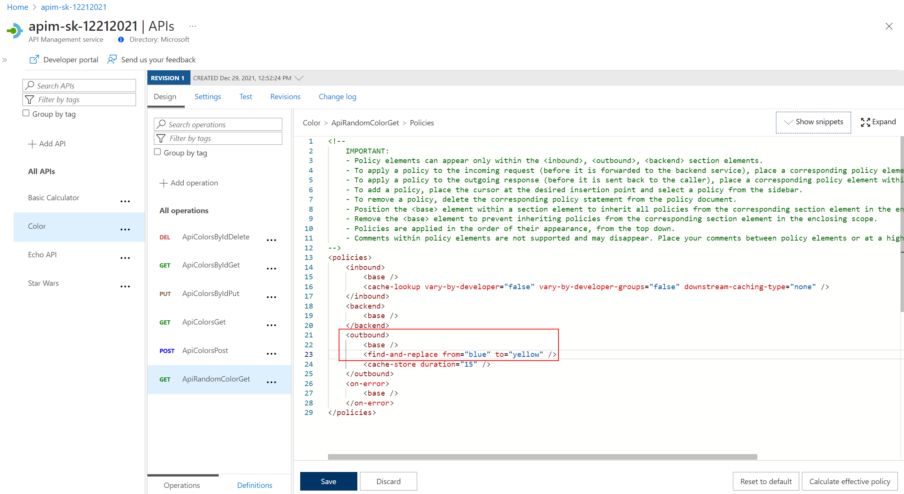
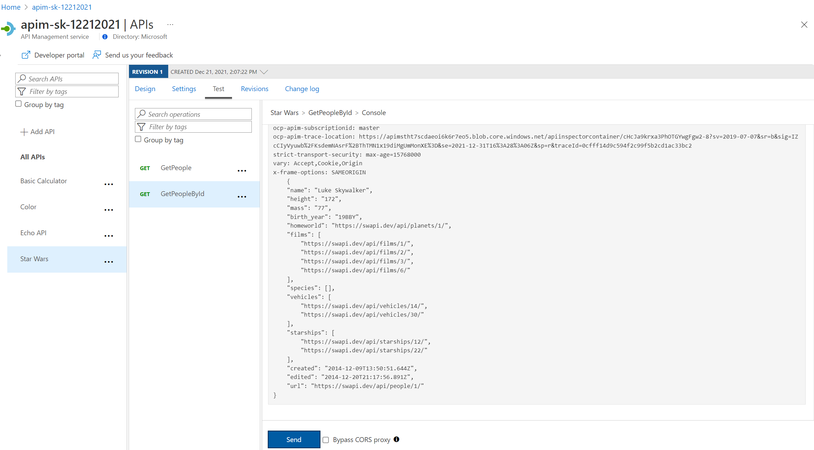
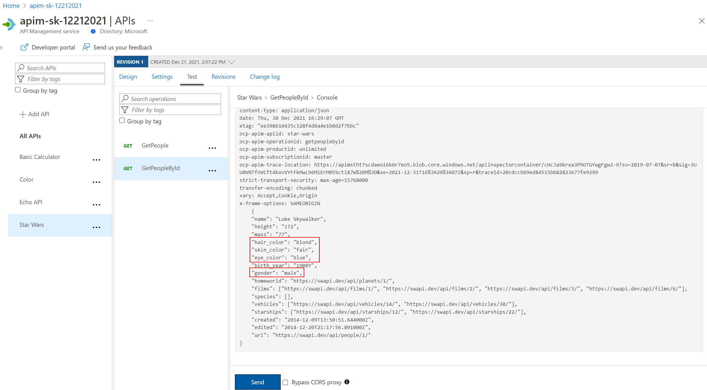
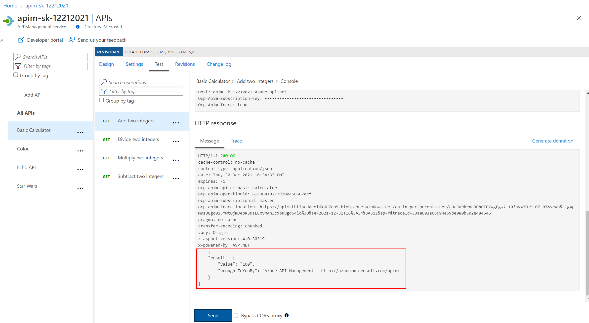
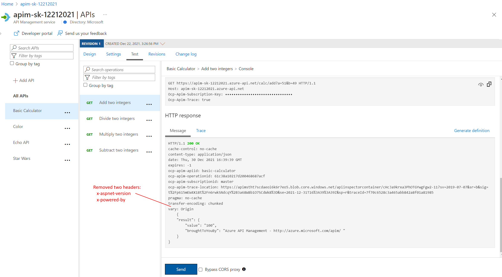
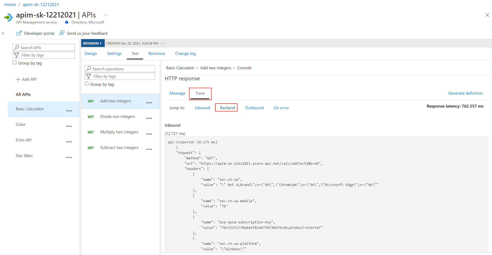
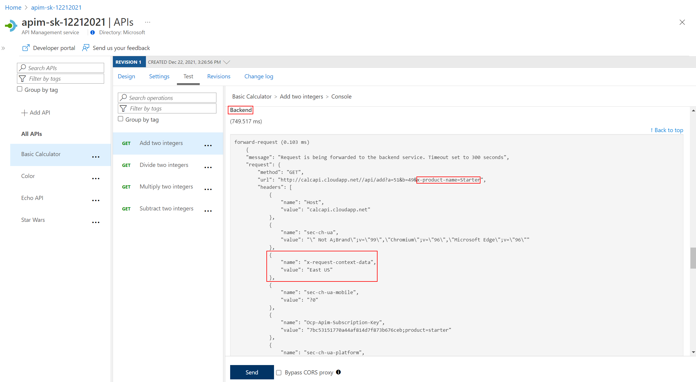

## Color API 

### Transformation - replace string

The *find-and-replace* policy finds a substring in a request or response and replaces it with a different string.

- Open the *Color* API, then open the `ApiRandomColorGet` operation.
- Enter the *Policy code editor* in the *Outbound processing* section.
- Place the cursor after the `<base />` element in the `<outbound>` section.
- Press *Show snippets*, then select the *Find and replace string in body* transformation policy.

  

- Fill in the `from` and `to` values accordingly:

  ```xml  
  <outbound>
      <base />
      <find-and-replace from="blue" to="yellow" />
      <cache-store duration="15" />
  </outbound>
  ```

  

- Save the policy, then invoke the API using the Unlimited subscription key.

  

---

## Star Wars API

### Transformation - conditional

Policies can be applied very granularly. In this example, you are modifying the *Star Wars* API to return a limited set of information if the caller is using the *Starter* subscription. Other products, such as the *Unlimited* subscription, will receive the full response.  

The [context variable](https://docs.microsoft.com/en-us/azure/api-management/api-management-policy-expressions#ContextVariables) that is implicitly available in every policy expression provides access to the `Response` and `Product` below. 

- Open the *Star Wars* API, then open the *GetPeopleById* operation.
- Similarly to the *Color* API, add the outbound policy to conditionally change the response body.  
Note that the inbound `Accept-Encoding` header is set to `deflate` to ensure that the response body is not encoded as that causes the JSON parsing to fail.  

  ```xml
  <policies>
      <inbound>
          <base />
          <set-header name="Accept-Encoding" exists-action="override">
              <value>deflate</value>
          </set-header>
      </inbound>
      <backend>
          <base />
      </backend>
      <outbound>
          <base />
              <choose>
                  <when condition="@(context.Response.StatusCode == 200 && context.Product.Name.Equals("Starter"))">
                      <set-body>@{
                              var response = context.Response.Body.As<JObject>();

                              foreach (var key in new [] {"hair_color", "skin_color", "eye_color", "gender"}) {
                                  response.Property(key).Remove();
                              }

                              return response.ToString();
                          }
                      </set-body>
                  </when>
              </choose>
          </outbound>
      <on-error>
          <base />
      </on-error>
  </policies>
  ```

- Test the API on the *Test* tab with *id* 1 and apply the appropriate *Starter* or *Unlimited* product scope. Examine the different responses.

- With *Starter* product scope:

  

- With *Unlimited* product scope. Notice the four properties in red that are not included in the *Starter* scope response.

  

---

## Calculator API 

### Transformation - XML to JSON

A frequent requirement is to transform content, especially to maintain compatibility with legacy APIs. For this lab we are going back to the *Calculator* API that returned an XML response. 

- Add an outbound policy to the *Add two integers* operation on the *Calculator* API to transform the response body to JSON.

  ```xml
  <outbound>
      <base />
      <xml-to-json kind="direct" apply="always" consider-accept-header="false" />
  </outbound>
  ```

- Test the API and examine the response. Note that it's now JSON.

  

### Delete response headers

A frequent requirement is to remove headers, especially ones that return security-related or superfluous information.

- Add an outbound policy to the same *Calculator* API operation to remove specific response headers.

  ```xml
  <outbound>
      <base />
      <xml-to-json kind="direct" apply="always" consider-accept-header="false" />
      <set-header name="x-aspnet-version" exists-action="delete" />
      <set-header name="x-powered-by" exists-action="delete" />
  </outbound>
  ```

- Invoke the API and examine the response, which now no longer contains the two headers. See above screenshot for how it looked prior.

  

### Amend what's passed to the backend

Query string parameters and headers can be easily modified prior to sending the request on to the backend. 

- Back in the same *Calculator* API operation, add inbound policies to modify the query string and headers. 

  ```xml
  <inbound>
      <base />
      <set-query-parameter name="x-product-name" exists-action="override">
          <value>@(context.Product.Name)</value>
      </set-query-parameter>
      <set-header name="x-request-context-data" exists-action="override">
          <value>@(context.Deployment.Region)</value>
      </set-header>
  </inbound>
  ```

- Test the call by using either the *Starter* or *Unlimited* product, then inspect the result on the *Trace* tab.

  

  