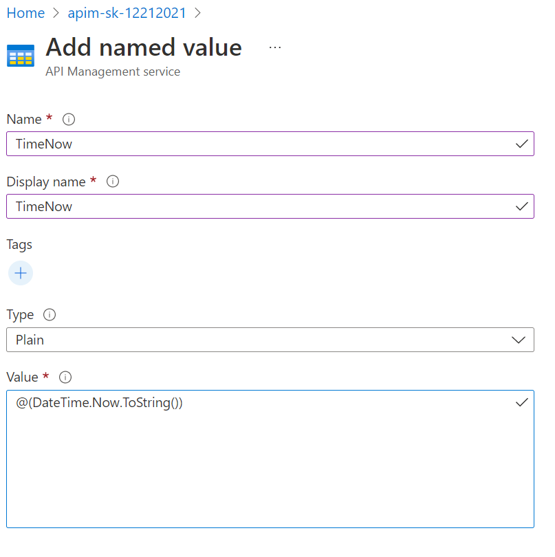

## Calculator API

### Named Values collection

*Named Values* (aka *Properties*) are a collection of key/value pairs that are global to the service instance. These properties can be used to manage `string` constants across all API configurations and policies. Values can be expressions, secrets (encrypted by APIM), or Key Vault, which links to a corresponding secret in Azure Key Vault.

- Open the `Named values` blade in the resource menu and press **+ Add**.
- Create the new property:
  - Name: **TimeNow**
  - Display name: **TimeNow**
  - Type: **Plain**
  - Value: `@(DateTime.Now.ToString())`

    

- Back in the *APIs* blade, open the *Add two integers* operation in the Calculator API. 
- Amend the `set-header` policy by clicking on the pencil icon.
- Create a new header by pressing **+ Add header**:
  - Name: **x-request-received-time**
  - Value: `{{"{{TimeNow"}}}}`
  - Action: **override**  
- The corresponding XML in the *Code editor* view should look like this: 

  ```xml    
  <inbound>
      <base />
      <set-query-parameter name="x-product-name" exists-action="override">
          <value>@(context.Product.Name)</value>
      </set-query-parameter>
      <set-header name="x-request-context-data" exists-action="override">
          <value>@(context.Deployment.Region)</value>
      </set-header>
      <set-header name="x-request-received-time" exists-action="override">
          <value>{{"{{TimeNow"}}}}</value>
      </set-header>
  </inbound>
  ```

- Test the operation by selecting the *Starter* or *Unlimited* product scope. 
- Examine the backend trace to find the added header with the evaluated named value:

  ```json
  {
    "name": "x-request-received-time",
    "value": "12/30/2021 6:10:47 PM"
  }
  ```