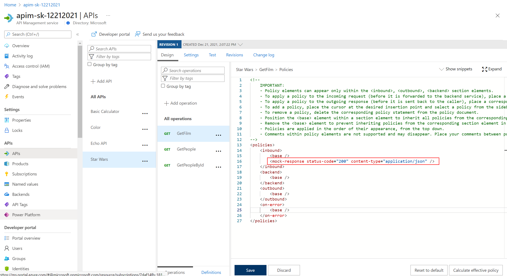
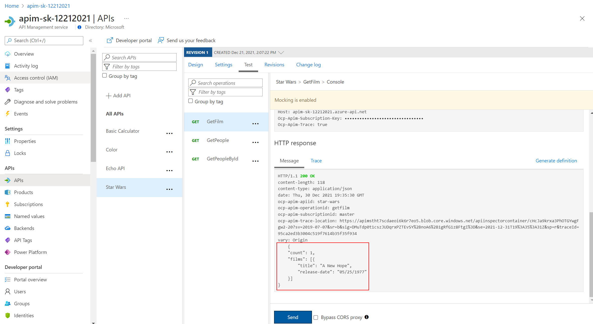

## Star Wars API

### Mock responses

Mocking in APIM is a useful mechanism for API consumers to interact with APIs without waiting for the backend to be ready. 

- Open the Star Wars API and select **+ Add Operation**
- Create a new GET operation:
  - Display name: **GetFilm**
  - Name: **getfilm**
  - URL: **/film**
- In the *Responses* configuration tab, press **+ Add response**, return `200 OK` with a representation with content type `application/json` and this sample data:

  ```json
  {
    "count": 1,
    "films": [{ "title": "A New Hope", "release-date": "05/25/1977" }]
  }
  ```
  
  

- Open the Inbound processing 'Code View'
- Add *Mock Response* under *Other policies* after the `<base /> tag.

  

- Invoke the API to receive a `200` success with the mocked film data.

  
