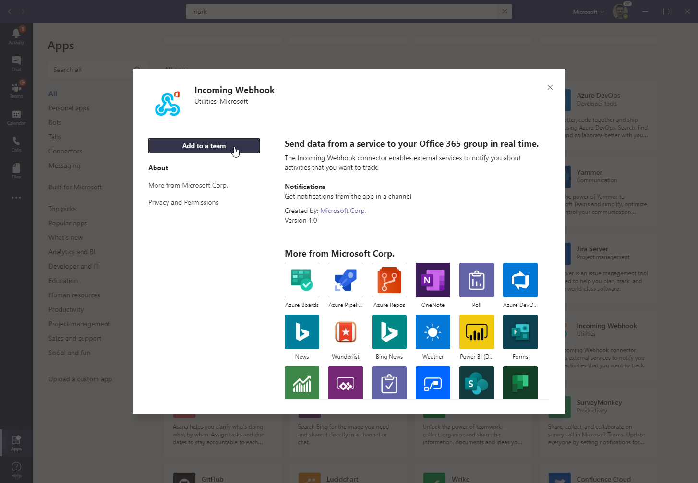
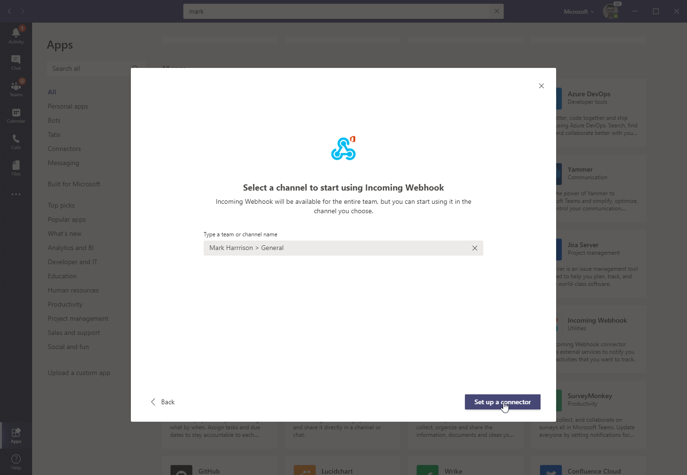
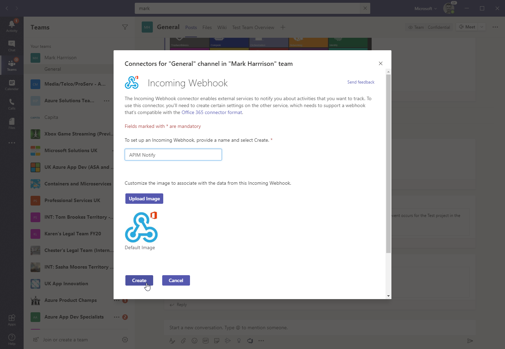
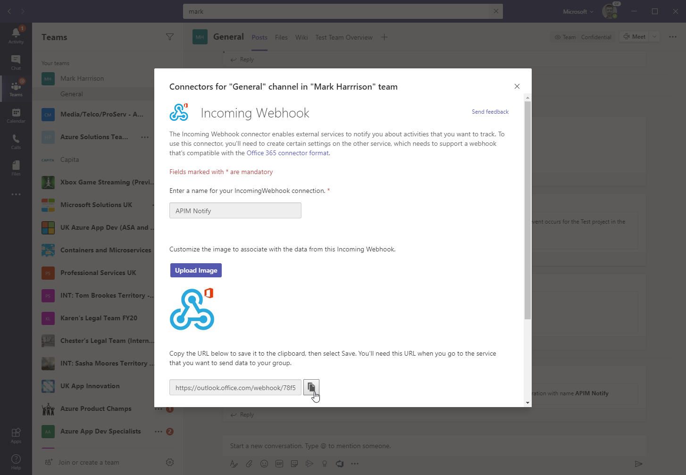
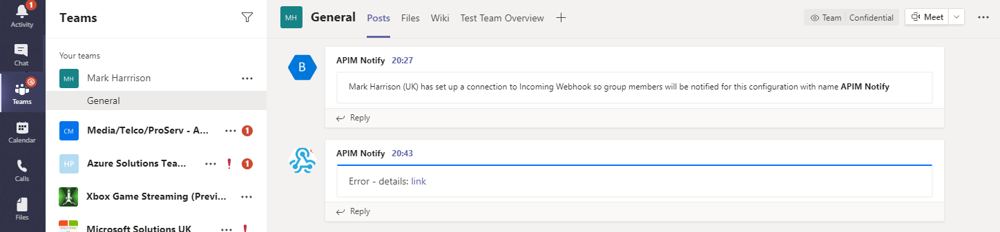

## Calculator API

### Send a message to Microsoft Teams channel

> You can also send messages to other products such as Slack.

APIM integrates well with [external services](https://docs.microsoft.com/en-us/azure/api-management/api-management-sample-send-request) via HTTP-based interaction.  

This example shows a fire-and-forget [send-one-way-request](https://docs.microsoft.com/en-us/azure/api-management/api-management-sample-send-request#send-one-way-request) policy, which does not await a response. Alternatively, you can use a [send-request](https://docs.microsoft.com/en-us/azure/api-management/api-management-sample-send-request#send-request) policy to send a request and await a return. Some complex in-flight processing logic may also be better handled by using Logic Apps.

For Microsoft Teams

- First, open Teams and enable a Webhook connector for your team.
  - Get the URL of the webhook.

    
    
    
    
    
    
    

- Format the required payload. The payload sent to a Teams channel uses the [MessageCard](https://docs.microsoft.com/en-us/microsoftteams/platform/task-modules-and-cards/cards/cards-reference) JSON schema. You can experiment with different cards in the [MessageCard Playground](https://messagecardplayground.azurewebsites.net/).
  
- Open the Calculator API 'Code View'.
- Add the `send-one-way-request` policy to *Outbound processing* and replace the webhook and payload as required.

  ```xml
  <outbound>
      <base />
      <choose>
        <when condition="@(context.Response.StatusCode >= 299)">
          <send-one-way-request mode="new">
            <set-url>
              https://outlook.office.com/webhook/78f54a63-f217-451a-b263-f1f5c0e866f0@72f988bf-86f1-41af-91ab-2d7cd011db47/IncomingWebh00k/34228a8ccbe94e368d3ac4782adda9b2/4e01c743-d419-49b7-88c6-245e5e31664a
            </set-url>
            <set-method>POST</set-method>
            <set-body>@{
              return new JObject(
                new JProperty("@type","MessageCard"),
                new JProperty("@context", "http://schema.org/extensions"),
                new JProperty("summary","Summary"),
                new JProperty("themeColor", "0075FF"),
                new JProperty("sections",
                  new JArray (
                    new JObject (
                      new JProperty("text","Error - details: [link]  (http://azure1.org)")
                    )
                  )
                )
              ).ToString();
            }</set-body>
          </send-one-way-request>
        </when>
      </choose>
  </outbound>  
  ```

- For demo purposes, amend the condition so it always fires (i.e. `StatusCode = 200`).
  ```xml
    <when condition="@(context.Response.StatusCode == 200)">
  ```
- Invoke the API and observe the `200` success response.
- Look for a received message in your Teams channel:

  
