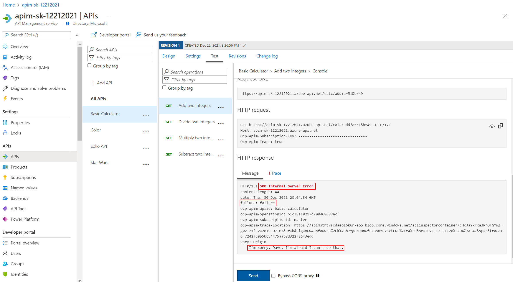

## Calculator API

### Aborting the processing

The ability to terminate a response gracefully is of importance in a number of cases such as error handling or business logic yielding a response that does not necessitate to originate from the backand and can instead be issued by APIM. Consider what general situations may make sense without shifting too much business logic into APIM.

- Open the Calculator API 'Code View'.
- Add the inbound policy to test for a condition and return an error.
- Invoke the API - with Authorization header as above ... should get a 599 error
- Replace the condition with some more meaningful code

  ```xml
  <inbound>
      <base />
      <choose>
          <when condition="@(true)">
              <return-response response-variable-name="existing response variable">
                  <set-status code="500" reason="Internal Server Error" />
                  <set-header name="failure" exists-action="override">
                      <value>failure</value>
                  </set-header>
                  <set-body>I'm sorry, Dave. I'm afraid I can't do that.</set-body>
              </return-response>
          </when>
      </choose>
  </inbound>
  ```

  