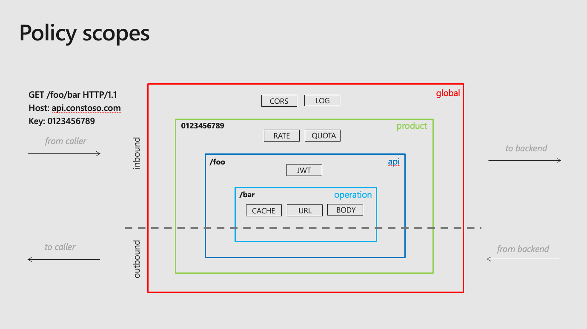
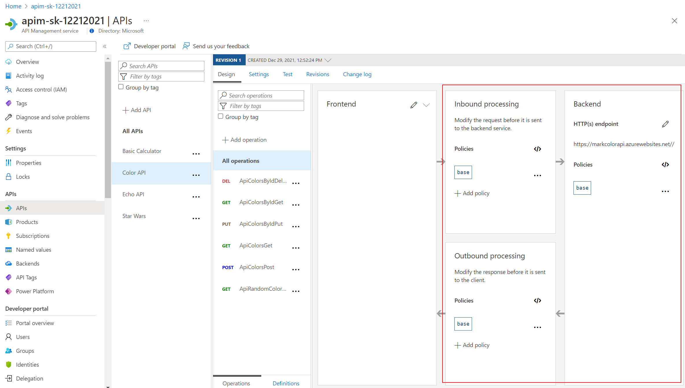
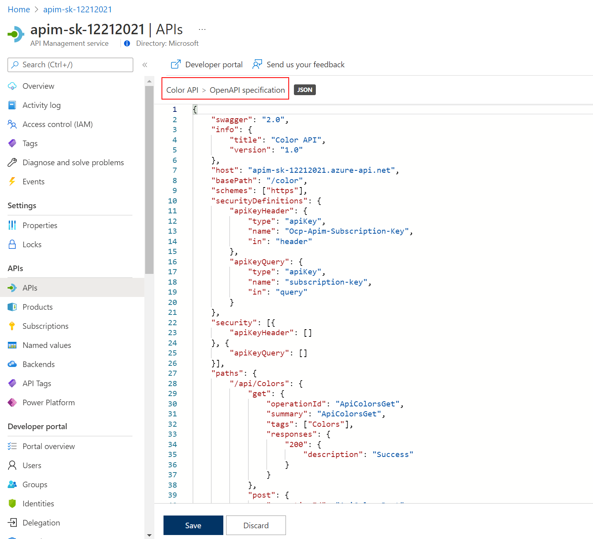
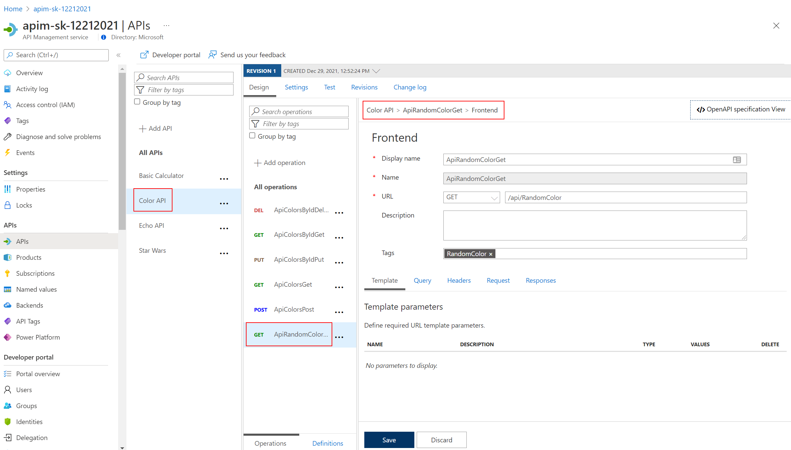
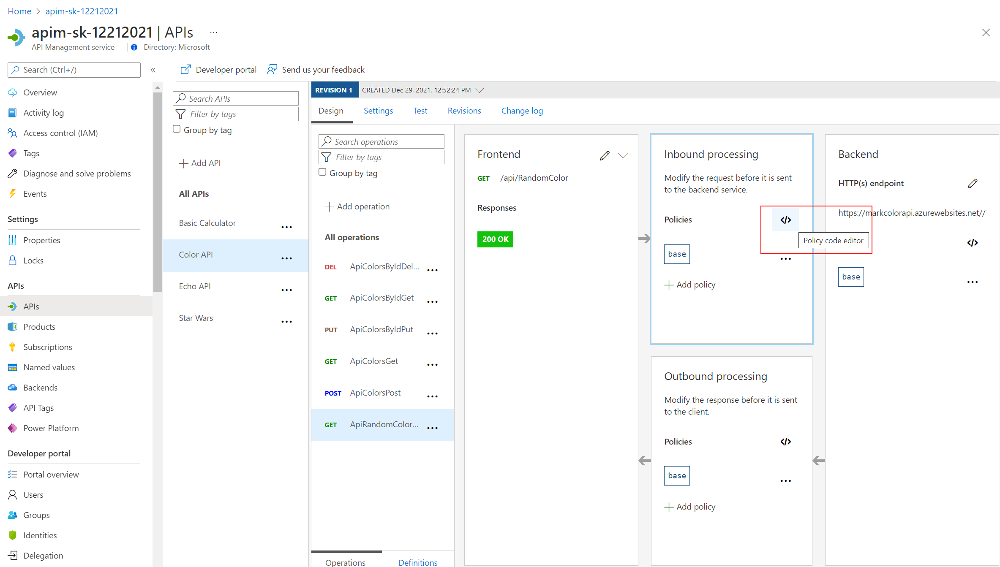
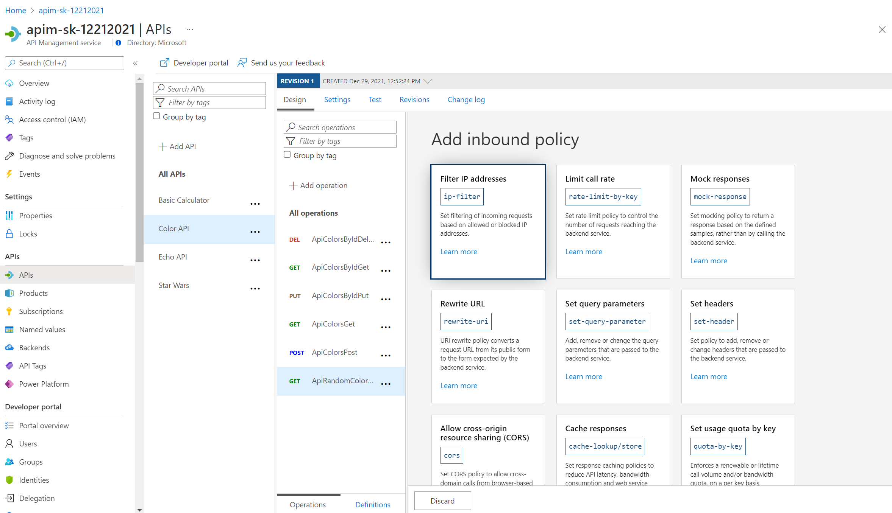

## Policy Expressions

Policy Expressions are used to control traffic to and modify the behavior of the Backend API. At the time of this writing, [APIM policy expressions support C# 7](https://docs.microsoft.com/en-us/azure/api-management/api-management-policy-expressions). Please note that a specific subset of .NET Framework types, not the entire Framework, are made available. This is to cover the most frequently-needed types and operations without introducing bloat into APIM.  

Using C# statements and an ability to access the API context, as well as your API Management service configuration, Policy Expressions are a powerful way to modify the behavior of the API at runtime.

Don't hesitate to read the [APIM policies documentation](https://docs.microsoft.com/en-us/azure/api-management/api-management-policies).

We had a brief look earlier at setting CORS policies. Lets dive in a bit deeper:

Policies can be applied at multiple scopes and follow this hierarchy. It is important to understand at what level to apply policy to appropriately yield security, robustness, and flexibility.

### Getting Started - Frontend/Inbound/Outbound/Backend

Select an API (e.g. *Color*). Policy can be configured for *Inbound processing*, *Backend*, and *Outbound processing*. Most commonly, policies are applied in the *Inbound processing* section. Select the pencil icon to visually edit any section or the `</>` code brackets to edit the underlying XML. The configuration can be scoped to the API (All operations) or to an individual operation.

The *Frontend* section allows for editing of the OpenAPI / Swagger definition.

Editing the Frontend:
  - If editing an operation, there is a choice of the *Code View* or *Forms-based* editor.
  - If editing an API, the only option is the *Code View* editor.
  - The *Code View* editor allows amendments to the OpenAPI / Swagger definition.

    

    

Editing *Inbound processing / Outbound processing / Backend*:

- Using the *Code Editor*:

  

- Using the *Form Editor*:

  

  