### Make changes in code and create a PR

```Note: Make sure you have completed "Publish APIM artifacts in Azure DevOps utilizing the publisher tool" section before completing this section as you need the publisher pipeline to be in place before you start pushing code changes.```
1. Clone the apim-artifacts repo on your local machine. This is the repo the extractor pipeline pulls in the APIM artifacts.
2. Open the folder in Visual Studio Code. Create a new branch to make your changes in.
   -  ```
        git checkout -b feature/api-code-changes
      ```

    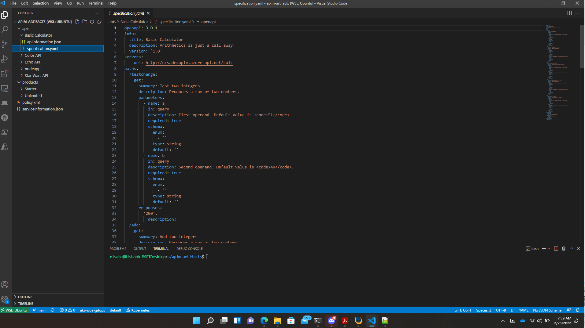
3. You can view the API definitions using the VSCode OpenAPI preview.

    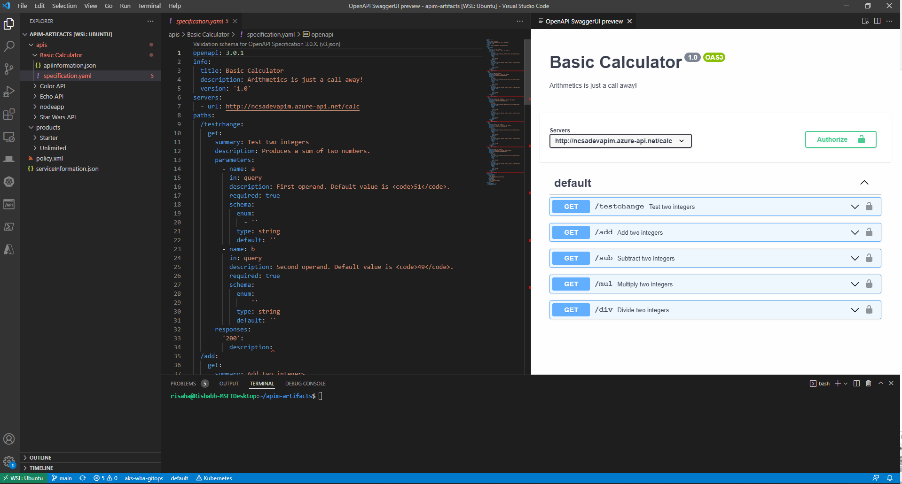
4. Install the OpenAPI (Swagger) Visual Studio Code (VS Code) [extension](https://marketplace.visualstudio.com/items?itemName=42Crunch.vscode-openapi) which adds rich support for the OpenAPI Specification (OAS) (formerly known as Swagger Specification) in JSON or YAML format
5. Open a OpenAPI spec file in the apis/API_NAME/Original/1/specification.yaml folder and view using the above extension.

    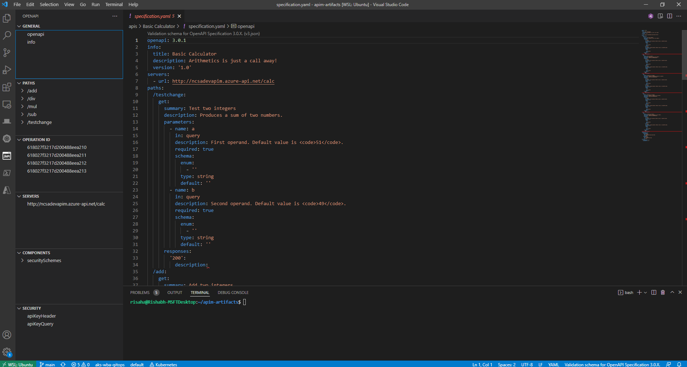
6. Modify an existing API by adding a new path. You can use the extension or edit it directly in the yaml spec.

    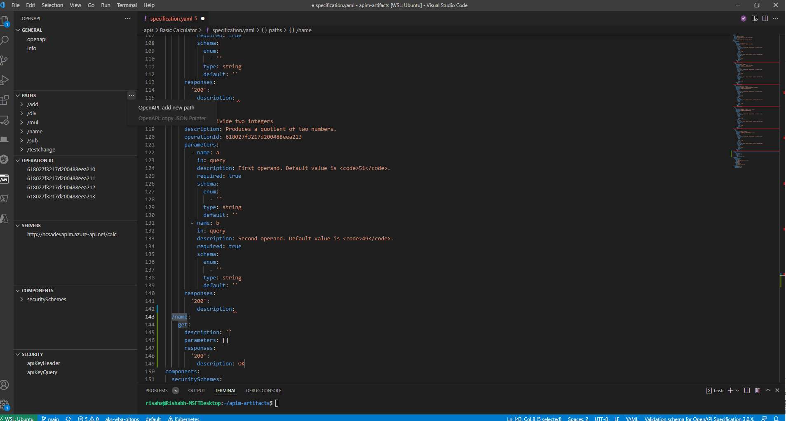  
7. Example - this shows a new path /apiops been added to an existing API.

    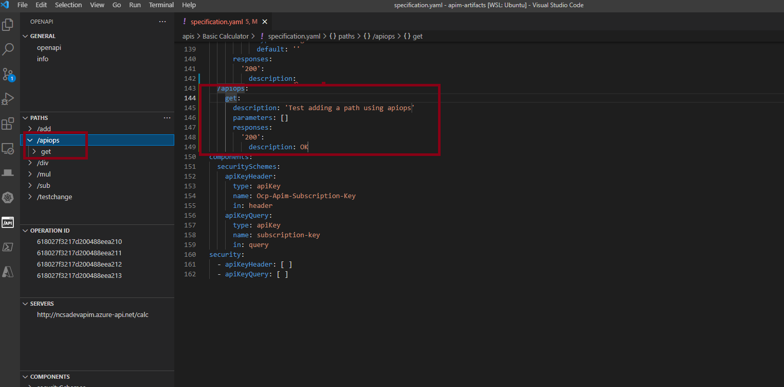  
8. Check the files that were modified.

    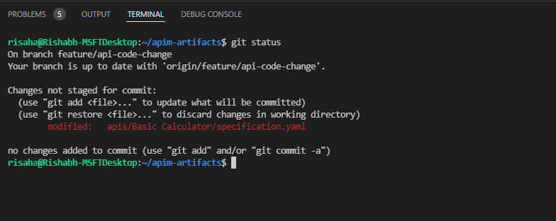 
9. Add, commit and push the changes to the Git Repository
    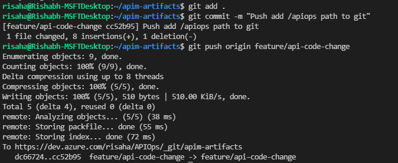 
10. Create a Pull Request to get the changes reviewed
    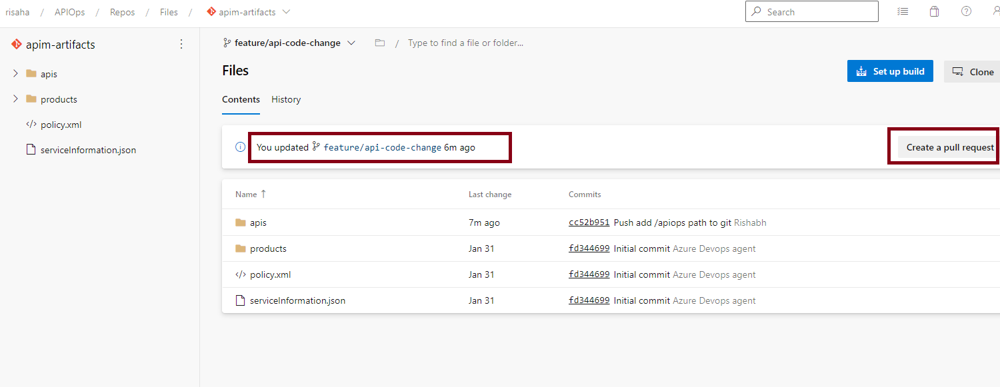 
11. Review the changes and approve and complete the Pull Request

    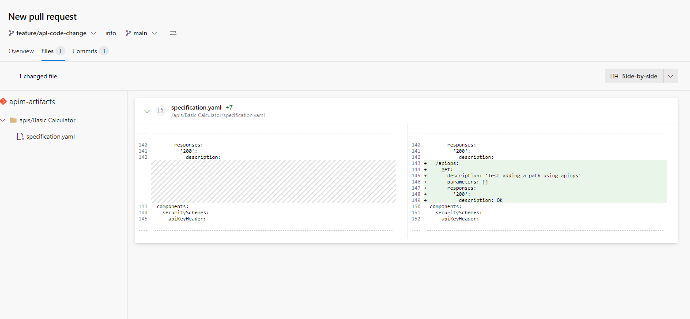

    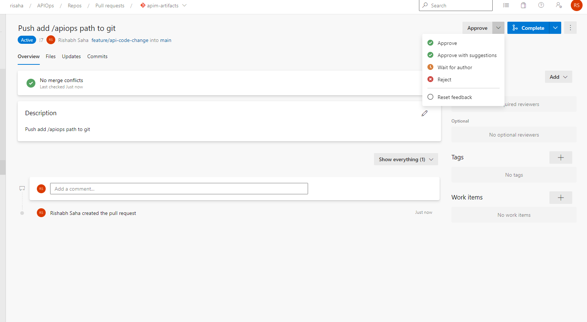

    
12. Once the changes have been merged into main it kicks off the run-publisher pipeline

    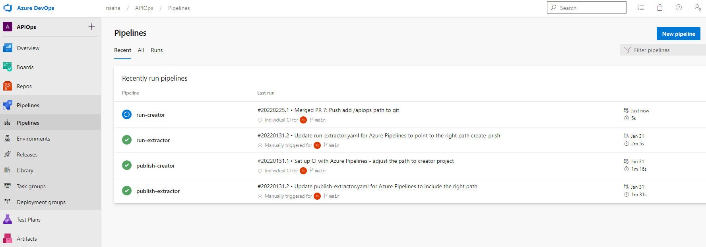

    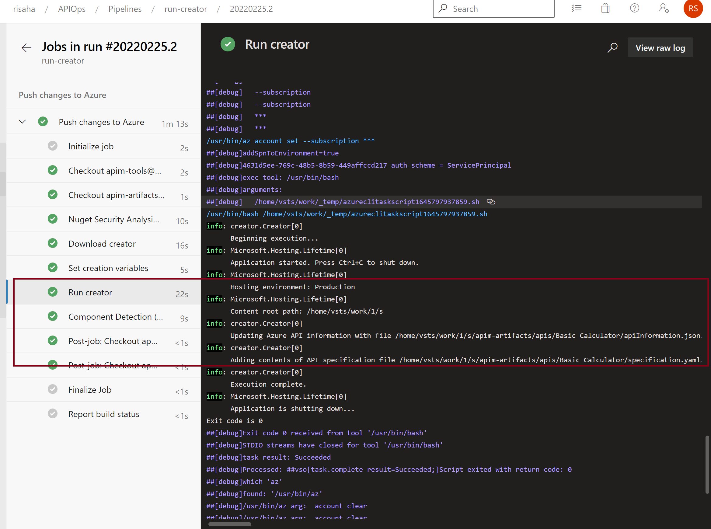

13. Once the pipeline runs successfully the changes should be visible in your APIM instance
     
     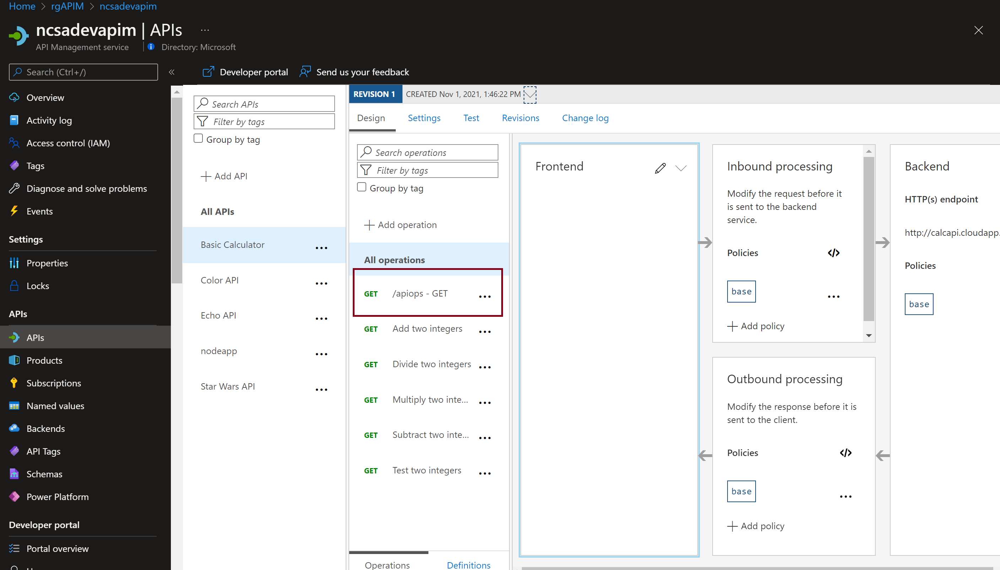

### Additional Thoughts
If you are new to Azure API management and plan on using the code first approach (Scenario B), one suggestion is to start by creating an api on the Azure portal (Scenario A) and enable the different features that you will need (e.g. policies, operations, subscriptions, products, etc.) and then use the extractor to extract the different artifacts. This way you can familiarize yourself with the structure of the specification.yaml and apiInformation.json files and use that as a template for other apis to follow. Also note that when working with apis there are two files that you need to work with which are the specification.yaml and apiInformation.json. In some cases the aforementioned files may include similar information (e.g. display name) in which case the information within the specification.yaml will take precedence if you change the same information in both files. The apiInformation.json will mainly come into play when dealing with APIM specific information like versioning, revisions, subscription requirement, etc..