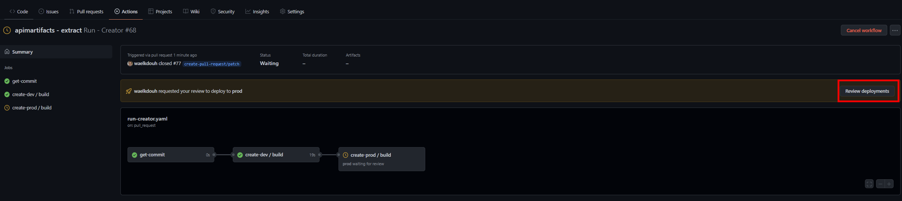
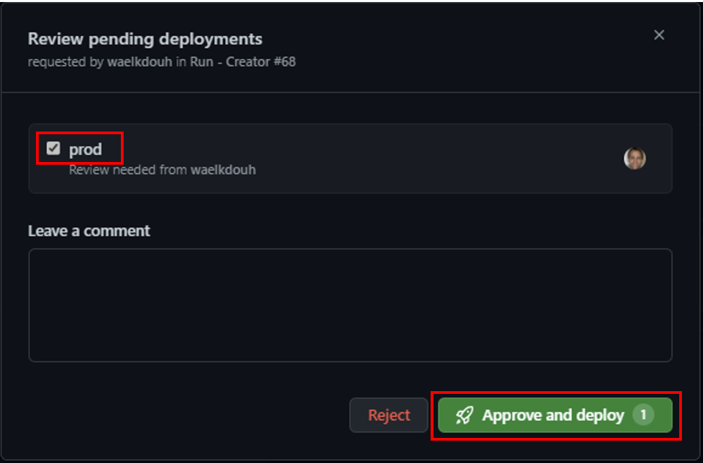

### Create pipeline to automatically push changes using publisher tool

1. Go back to the PR that was created in the previous step as a result of running the extractor. Once the PR is merged the run-publisher pipeline should automatically trigger. Remember that the publisher pipeline requires manual approval before promoting between stages. To promote to the prod environment, wait on the dev stage to succeed and then click on the "Review deployments" button and approve to deploy the changes to the prod environment.
 
2. Approve the prod environment for deployment. 
3. At this point you have successfully extracted the different apim artifacts and promoted them across different environments. But in an enterprise setting you may want to override some configurations as you move them between environments. For example you may have a policy which points to a backend url which is different across environments. Or you may be using a completely different application insights instance across environments. In order to override these configurations you will need to provide the overrides inside a environment specific configuration file which the publisher tool can pick up and parse when pushing the changes across different APIM instances. For example if you have three different environments (Dev -> QA -> Prod) then you would have two separate configuration files (e.g. configuration.qa.yaml and configuration.prod.yaml). Here is a [**sample configuration file**](https://github.com/Azure/apiops/blob/main/configuration.prod.yaml) which allows you to override a name value called environment before promoting it to the production environment. This way if you have some policies that you want them to be environment specific you can simply reference the environment within your policy xml files. For a full list of supported configuration overrides please refer to the [**Configure Apim Tools section**](https://azure.github.io/apiops/apiops/3-apimTools/apiops-2-2-tools-publisher.html).

4. Finally if you were to peek into [**run-publisher.yaml**](https://github.com/Azure/apiops/blob/main/tools/github_workflows/run-publisher.yaml) you will notice that the publisher tool expects a CONFIGURATION_YAML_PATH. As explained earlier in the apim tools section CONFIGURATION_YAML_PATH is used to provide the publisher tool with a path to the Yaml configuration file used to override different configurations when promoting across APIM environments. You will need a unique Yaml configuration file per environment  (e.g. configuration.prod.yaml for production).

    ```note: Always refer to the specific run-publisher.yaml file that you downloaded as part of your release and not the one hosted on the repo. ```
