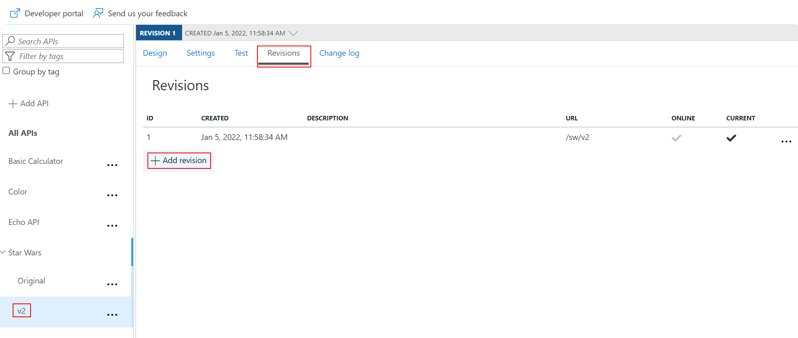
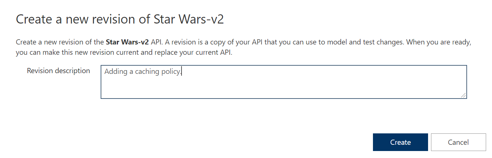
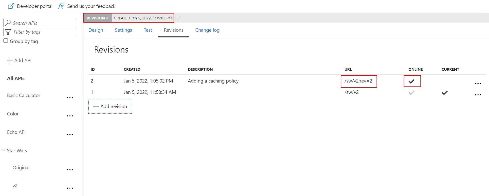
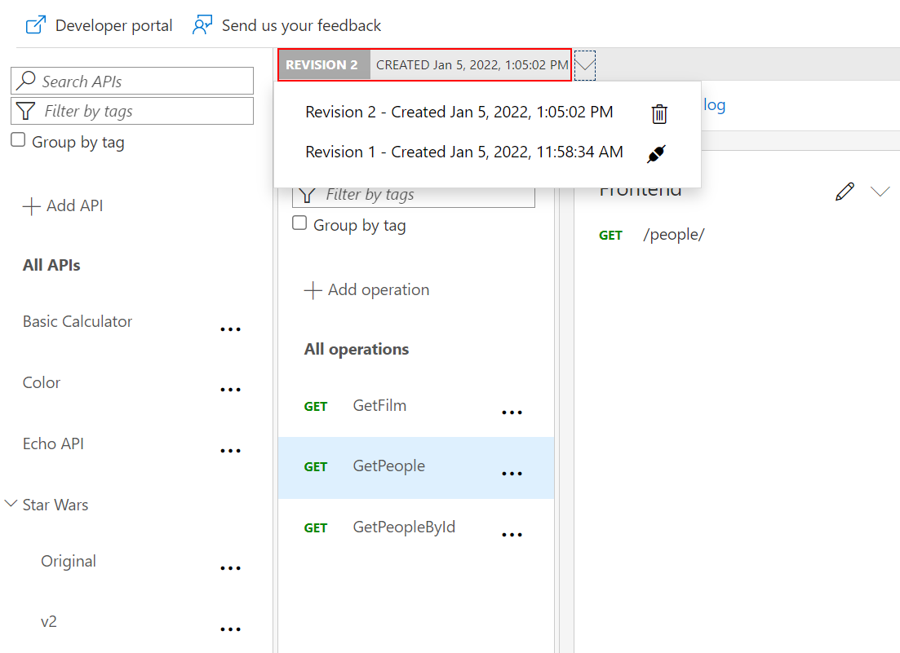
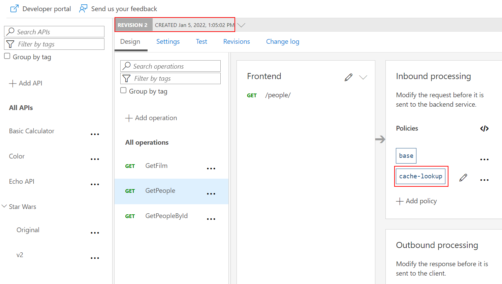
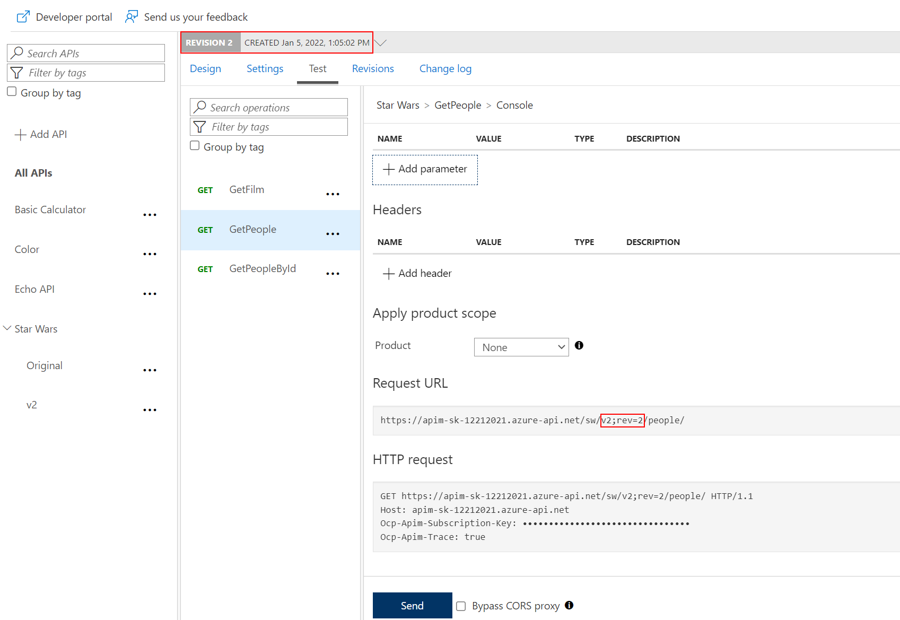
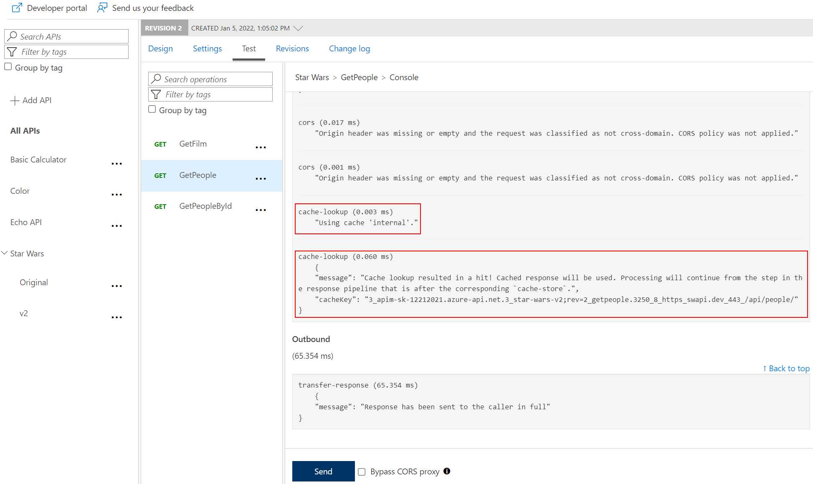
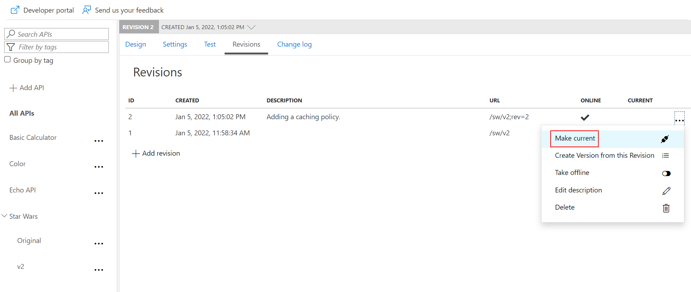
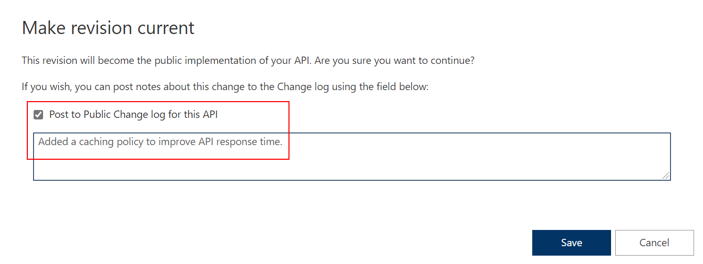
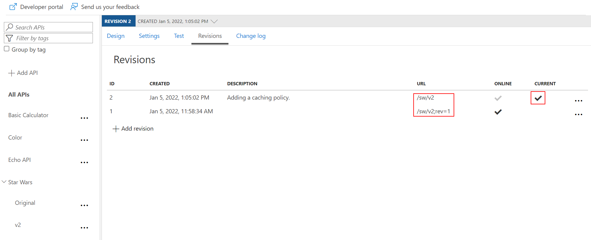

## Revisions

### Add a new revision

- Select the Star Wars API v2.
- Select the _Revisions_ tab.
- Add a new revision with description `Adding a caching policy.`

  
  

  > The new revision is online but not yet current. The previous revision continues to remain the active default. Having added the new revision has not resulted in change for your consumers.

  

### Add caching

- Select the `GetPeople` operation.
  > _Revision 2_ automatically became the active revision you are now making changes in. You can also switch between revisions, but be aware that changes to the _Current_ revisions are live immediately.

  

- Add a 10-second caching policy for the GET operation.

  

### Test the new revision

- From the Azure portal, test the `GetPeople` operation.
  > Note the revision number at the top of the page as well as in the request URL.  
  The request URL should look similar to: `https://<your-apim-name>.azure-api.net/sw/v2;rev=2/people/`.

  

- Test the API twice. The test trace should then show that the cache-lookup occurred. 

  

### Make current revision

- Select the _Revisions_ tab.
- Make `rev2` the current revision.

  

- Choose to post to the public change log for the API and provide a meaningful update.

  

- The new revision is now the current one. Note that the URL reflects the URL the consumer calls. The old revision is still online and can be accessed with the `rev` qualifier. 

  > Unlike versioning, revisioning requires no URL updates for the API consumer.

  