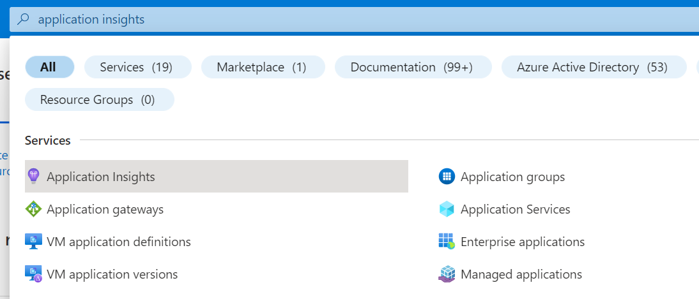
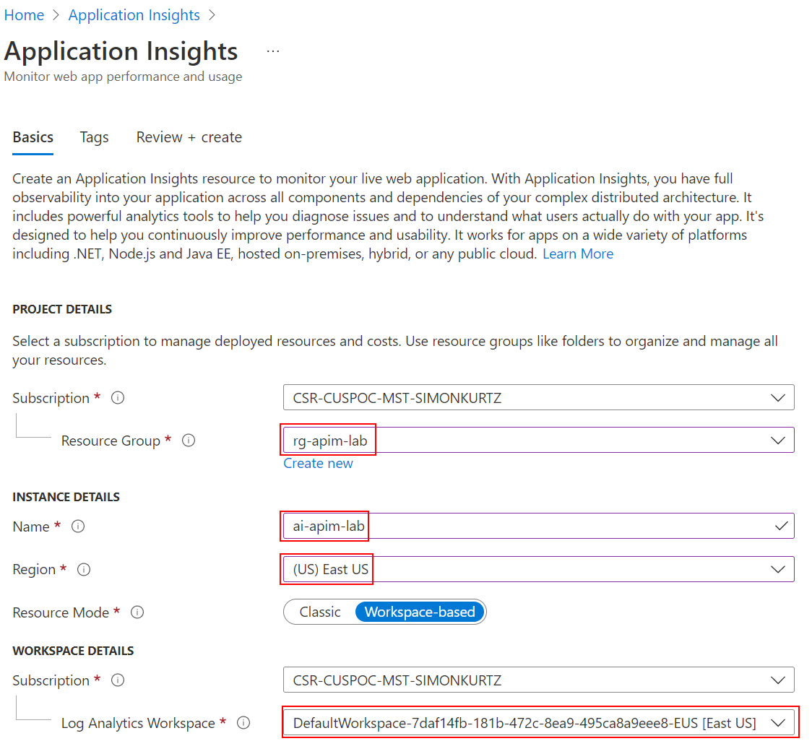
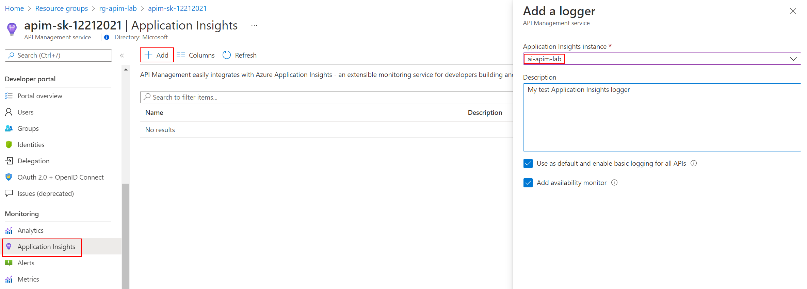
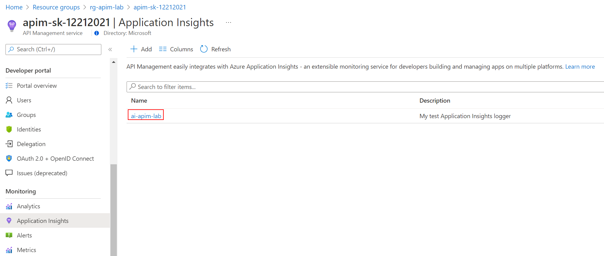
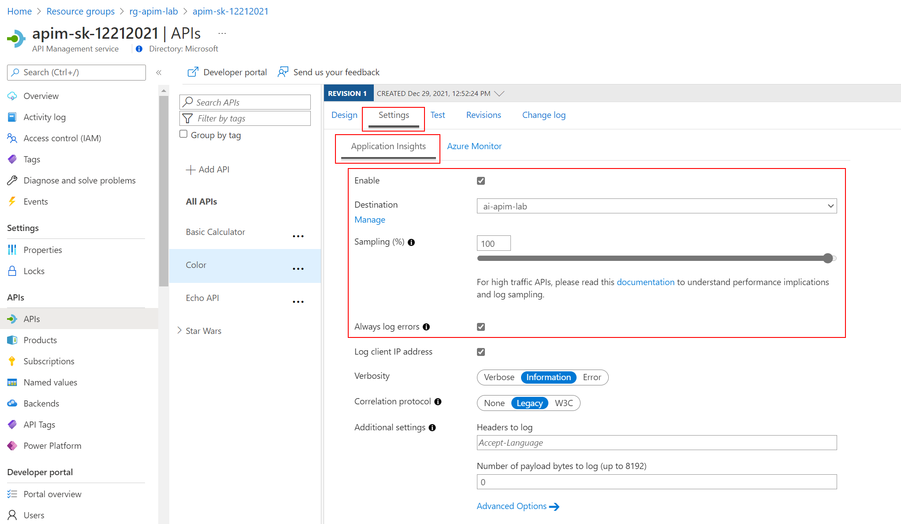
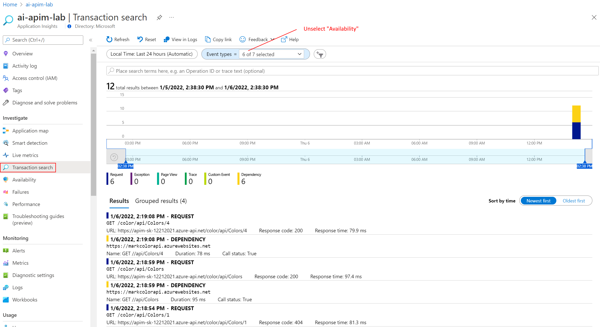

## How to integrate Azure API Management with Azure Application Insights

Azure API Management allows for easy integration with Azure Application Insights - an extensible service for web developers building and managing apps on multiple platforms. This guide walks through every step of such an integration and describes strategies for reducing performance impact on your API Management instance.

### Create an Azure Application Insights instance

Before you can use Azure Application Insights, you first need to create an instance of the service.

1. Open the **Azure portal** and navigate to **Application Insights**.
    
    

2. Click **+ Create**, then fill in the form. You may need to create a new Log Analytics Workspace if you don't already have one.

    

3. Click **Review + Create**, followed by **Create**.

### Create a connection between Azure Application Insights and Azure API Management service instance

1. Navigate to your **APIM** instance in the **Azure portal**.
2. Select **Application Insights** from the menu on the left.
3. Click **+ Add**. 

      

4. Select the previously created **Application Insights** instance and provide a short description.
5. Click **Create**.
6. You have just created an Azure Application Insights logger with an instrumentation key. It should now appear in the list.  

      

    > Behind the scenes, a [Logger](https://docs.microsoft.com/rest/api/apimanagement/2019-12-01/logger/createorupdate) entity is created in your API Management instance, containing the Instrumentation Key of the Application Insights instance.

### Enable Application Insights logging for your API

1. Select **APIs** from the menu on the left.
2. Click on the **Color** API.
3. Go to the **Settings** tab from the top bar.
4. Scroll down to the **Diagnostics Logs** section.
5. On the **Application Insights** tab check the **Enable** box.
6. In the **Destination** dropdown select the logger you just added in the **Application Insights** blade.
7. Set sampling to **100** to capture all events.
8. Check the **Always log errors** checkbox.

      

9. Click **Save**.

    > Overriding the default value **0** in the **Number of payload bytes to log** field may significantly decrease the performance of your APIs.

    > Behind the scenes, a [Diagnostic](https://docs.microsoft.com/rest/api/apimanagement/2019-12-01/diagnostic/createorupdate) entity named 'applicationinsights' is created at the API level.

### What data is added to Azure Application Insights

Azure Application Insights receives:

- *Request* telemetry item for every incoming request (*frontend request*, *frontend response*),
- *Dependency* telemetry item for every request forwarded to a backend service (*backend request*, *backend response*),
- *Exception* telemetry item, for every failed request.

A failed request is a request which:

- failed because of a closed client connection, or
- triggered an *on-error* section of the API policies, or
- has a response HTTP status code matching 4xx or 5xx.

### Viewing Azure Application Insights Data

- Go back to the **Application Insights** blade and click on the instance.
If you go into your Application Insights instance, after few seconds, you should be able to see logs and metrics:

    

### Performance implications and log sampling

> Logging all events may have serious performance implications, depending on incoming requests rate, payload size, etc.

Based on internal load tests, enabling this feature caused a 40%-50% reduction in throughput when request rate exceeded 1,000 requests per second. Azure Application Insights is designed to use statistical analysis for assessing application performances. It is not intended to be an audit system and is not suited for logging each individual request for high-volume APIs.

You can manipulate the number of requests being logged by adjusting the **Sampling** setting (see the steps above). 100% means all requests are logged, while 0% reflects no logging at all. **Sampling** helps to reduce the volume of telemetry, effectively preventing from significant performance degradation, while still carrying the benefits of logging.
Sampling is an effective tool in diagnosing often general operational issues. For example, sampling can identify connectivity or integration issues as these would often occur in high quantity, not singular instances. A sampling rate of 50% is as effective in diagnosing such issues as 100% is.

Skipping logging of headers and body of requests and responses will also have positive impact on alleviating performance issues.