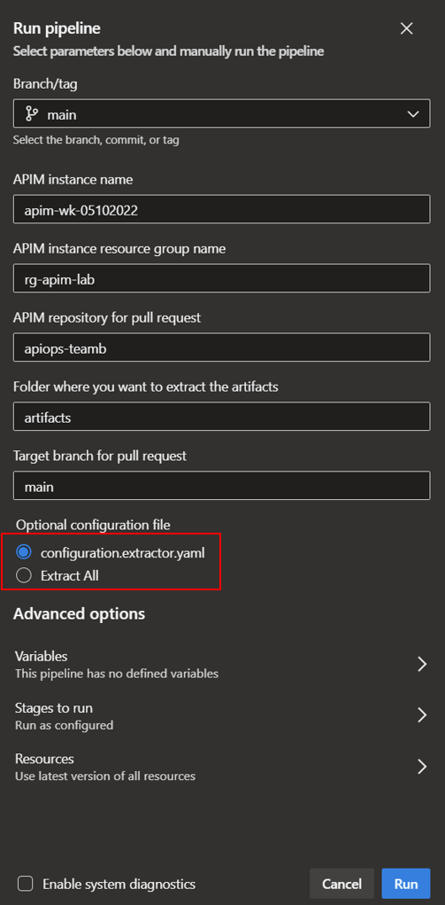
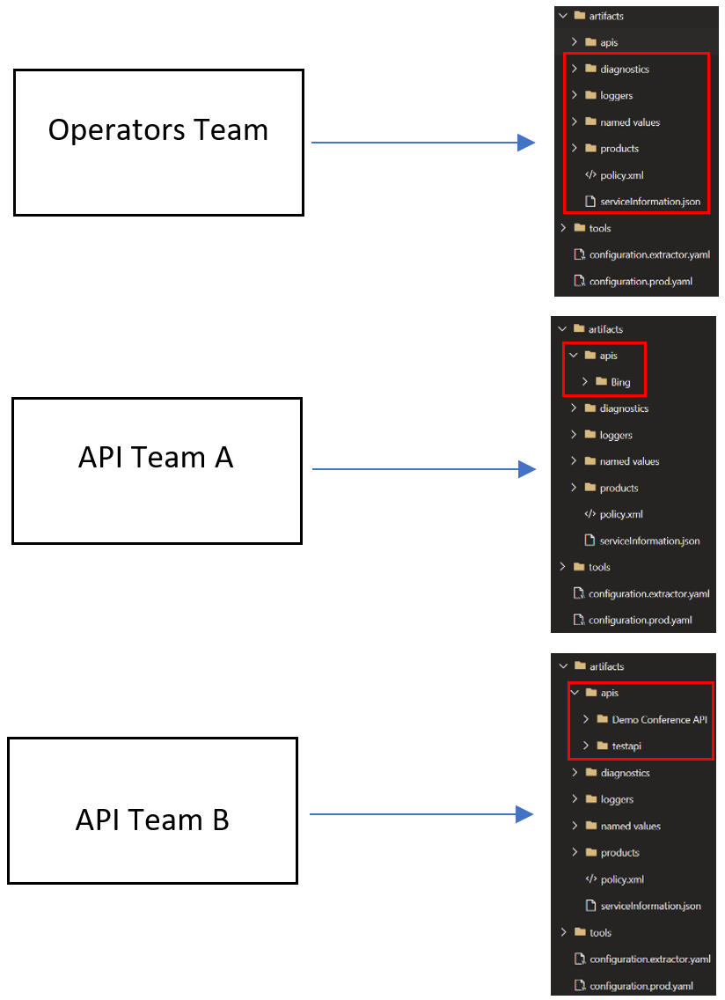

# Supporting Independent API Teams
So far all the guidance has made the assumption that all artifacts will be managed by a centralized team and thus all artifacts will be extracted into a single repository. In this section we will discuss the details involved in setting up a decentralized apim instance. Basically, the scenario involves having different teams managing different apis within an APIM instance. 

> **Note**
> The guidance also applies to cases where you are trying to extract select artifacts from an instance managed by a single team.

## Extracting Select Artifacts
The extractor tool supports extracting select artifacts which enables the following scenarios:
- Enabling different teams to work with different set of artifacts. For example team A can work on api1 and api2 while team B can work on api3 and api4
- Enables developers to experiment with an artifact on the azure portal without extracting it the next time the extractor tool runs. This allows the development team to safely experiment with apis in the Azure portal before its ready to be promoted to higher environments

In order to signal to the extractor tool to extract select artifacts you need to provide a configuration file (either yaml or json based) which includes the list of apis to extracted. Following the example above you can instruct the extractor tool to extract api1 and api2 by providing the following configuration file:

```yaml
apiNames:
  - api1
  - api2
```

Here are some rules to keep in minding when constructing your configuration.extractor.yaml file:

- A ``apiNames`` section which includes a bogus name (e.g. ignore) in configuration (``apiNames:[ignore]``) means no apis will be extracted. The reason we did not use an empty array instead to indicate ignoring an artifact has to do with the fact that an empty array doesn't work here is because of the way YAML configurations work with .NET configuration. Passing a field with an empty array is essentially the same not passing that field at all.
- A missing ``apiNames`` section in configuration means all apis will be extracted.
- A ``apiNames`` section with values means only apis with those names will be extracted.

Here is a complete list of all the supported artifacts that can be specified in the configuration.extractor.yaml file

```yaml
 apiNames:
  - apiName1
  - apiName2

 backendNames:
  - backendName1
  - backendName2

 diagnosticNames:
 - diagnosticName1
 - diagnosticName2

 loggerNames:
  - loggerName1
  - loggerName2

 namedValueNames:
  - namedValueName1
  - namedValueName2

 productNames:
  - productName1
  - productName2

 subscriptionNames:
 - subscriptionName1
 - subscriptionName2

 tagNames:
  - tagName1
  - tagName2
  
 policyFragmentNames:
  - policyFragment1
  - policyFragment2
```

Here is a link to a sample  [**extractor configuration file**](https://github.com/Azure/apiops/blob/main/configuration.extractor.yaml).


Here is the Azure Devops extractor pipeline windows offering either full extraction or selective api extraction through the configuration file: <br />


If the extractor successfully picks up the configuration file then you will notice that artifacts folder will only include the artifacts specified in the configuration file (e.g. specific apis and loggers).

## DevOps Process For Supporting Independent API Teams
Although each APIM DevOps team will have their own internal process, we would like to recommend a baseline approach for supporting independent API teams. This is by no means the only viable approach and thus you are free to setup your own DevOps process that best suits your organizational needs.

We envision having an operators team who will be responsible for APIM instance configurations (name/values, diagnostics settings, global policies, etc.) as well as different teams who will be exclusively focused on developing a subset of artifacts (e.g. separate apis or products). In the setup below we can see three different teams with each team extracting the artifacts to their own repo with the artifacts of interest in the red box. Now we recommend that you add a .gitignore file to each repo to ignore the files that are not of interest in the team to avoid accidental change of the files belonging to other teams.



## Controlling Changes to Specific APIs
Whereas the two previous sections offered options to either extract specific apis or use different repositories for different apis, there may be situations where a team prefers to have a mono-repo approach where all the apis are extracted into a single repository. In this case we recommend you look into limiting changes against certain apis to specific individuals. This can be achieved in both Github as well Azure Devops. In Github you can use a [CODEOWNERS](https://docs.github.com/en/repositories/managing-your-repositorys-settings-and-features/customizing-your-repository/about-code-owners) file to define individuals or teams that are responsible for specific apis in a repository. As for Azure Devops you can [automatically add reviewers](https://learn.microsoft.com/en-us/azure/devops/repos/git/branch-policies?view=azure-devops&tabs=browser#automatically-include-code-reviewers) to pull requests that change files in specific directories and files, or to all pull requests in a repo.
