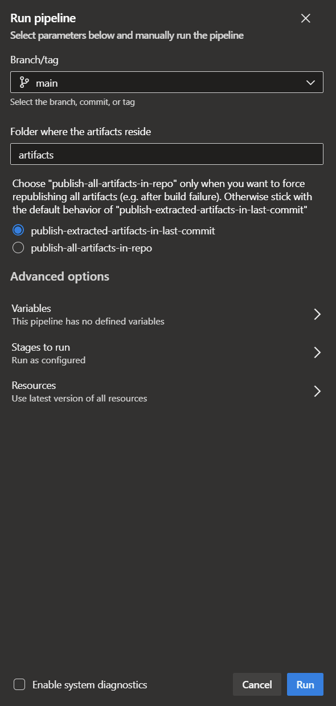
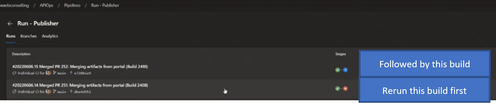

## Recovering from failed builds
Failed builds can happen due to intermittent issues or due to a misconfiguration, or simply a rejection of the code as its being promoted (this applies to the publisher only).
When running the extractor pipeline recovering from a failed build is straight forward as you can simply retrigger the extractor pipeline to regenerate the artifacts. The publisher pipeline on the other hand requires a bit more attention. There are couple scenarios which would require rerunning the publisher build pipeline. In this section we will cover these two use cases so you can account for them in your environment.
### Recovering from a failed build that involves added artifacts
This use case is straight forward as you can manually rerun the publisher  without passing a commit id. When the publisher pipeline is triggered without a commit id the publisher tool will republish everything that resides in the artifacts folder. As shown below you have the choice to manually trigger the Publish artifacts pipeline and choose to publish all the artifacts 

### Recovering from a failed build that involves deleted artifacts
Now if a build fails which involves deleted files then its a bit trickier as running without a commit id will republish all the artifacts and hence it won't capture the deleted file. Lets take a scenario where you are promoting the artifacts from lower environment to higher environment for the first time. Lets say that the build fails. Then someone decides to delete an api and push the code which now introduces a new commit. If you were to run the publisher against that last commit then you will loose the changes in the previous commit which captured the added artifacts. The solution here is to rerun the two failed builds in the proper order. In this case you would finish the failed build which was trying to add followed by the build which is deleting as shown in the image below:

