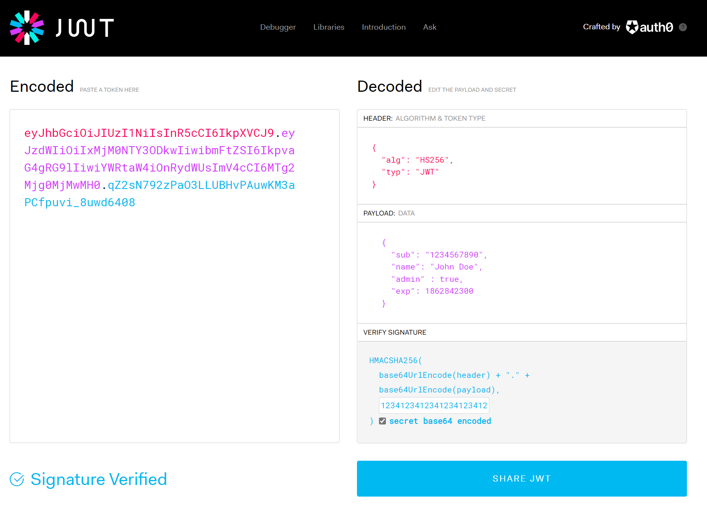
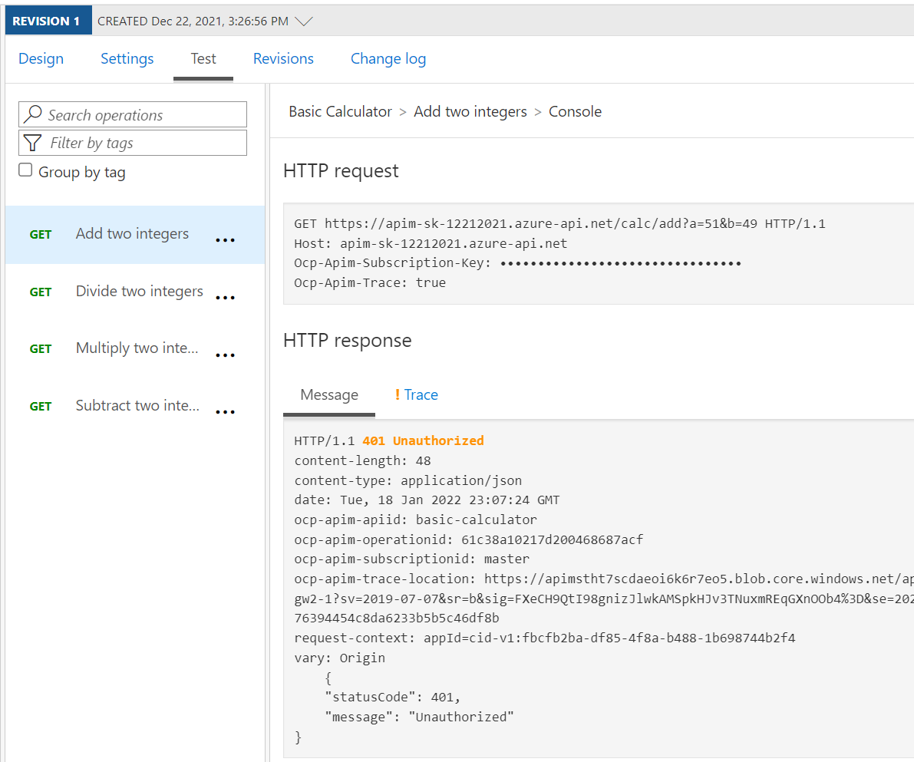
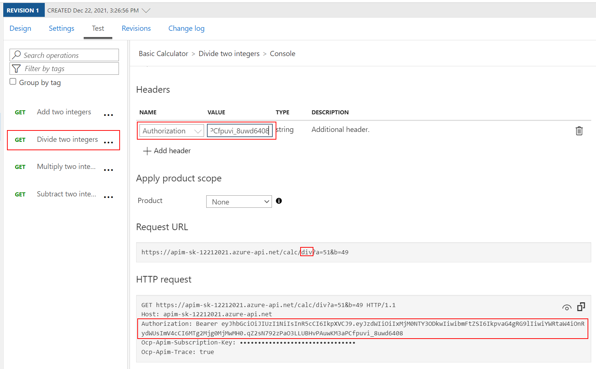
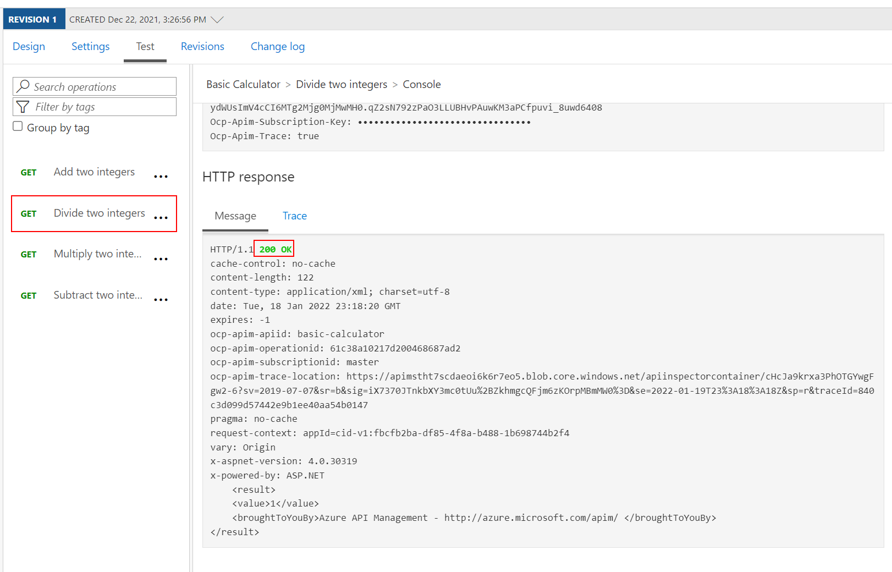
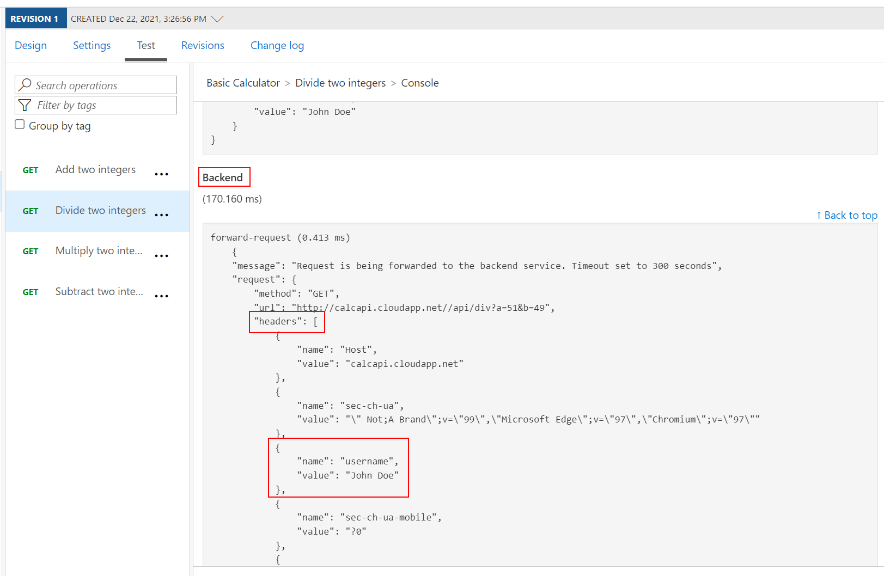

## Security

In this lab, we are going to see how to use JSON Web Tokens with your APIs.

### JSON Web Tokens (JWT) - Creation

JSON Web Tokens are an open-industry standard method for representing claims securely between two parties. More info at <https://jwt.io>. 

Use the following sites:
- <https://www.unixtimestamp.com> to get a future date using the Epoch Unix Timestamp _at least one hour from the current time_ as the JWT will not work otherwise (e.g. 01/11/2029 = `1862842300`)

- <https://jwt.io> to create a JWT with payload. In the **Decoded** section make these changes:
  - Leave the **Header** as is.
  - Use the following **Payload**:

    ```json
    {
      "sub": "1234567890",
      "name": "John Doe",
      "admin" : true,
      "exp": 1862842300
    }
    ```

  - In the **Verify Signature** area use a 256-bit key that will also be used in the APIM policy. We used `123412341234123412341234` as an example, which is a rather weak secret but serves the demo purpose.
  - Check **secret base64 encoded**.
  - Your configuration should be similar to this now:

    

### JSON Web Tokens (JWT) - Validation

- Back in APIM, open the *Calculator* API and select *All operations*.
- In the 'Code View' add an inbound `validate-jwt` policy with the signing key.

  ```xml
  <policies>
      <inbound>
          <base />
          <validate-jwt header-name="Authorization" failed-validation-httpcode="401" failed-validation-error-message="Unauthorized">
              <issuer-signing-keys>
                  <key>123412341234123412341234</key>
              </issuer-signing-keys>
          </validate-jwt>
      </inbound>
      ...
  </policies>
  ```

- Invoke the *Divide two integers* method on the API from the *Test* tab. Observe the `401` Unauthorized error.

  

- Now add the following `Authorization` header to the test:
  - Name: `Authorization`
  - Value: `Bearer <jwt token>` 
    - Replace `<jwt token>` with the *encoded* value from <https://jwt.io> above

  Note the bearer token in the Request payload.

  

- Execute the test once more to see a `200` Success. 

  

### JSON Web Tokens (JWT) - Check that a Claim Exists

Not only is it important that a JWT is valid, but as we use it for authorization, we must also assert that the token contains expected claims before granting access to our APIs.

- Open the *Calculator* API and select *All operations*.
- Modify the inbound `validate-jwt` policy to not only validate the JWT but ensure that a specific `admin` claim exists. Recall that we set `admin`: `true` in our JWT token on <https://jwt.io> above.

  ```xml
  <policies>
      <inbound>
          <base />
          <validate-jwt header-name="Authorization" failed-validation-httpcode="401" failed-validation-error-message="Unauthorized">
              <issuer-signing-keys>
                  <key>123412341234123412341234</key>
              </issuer-signing-keys>
              <required-claims>
                  <claim name="admin" match="any">
                      <value>true</value>
                  </claim>
              </required-claims>
          </validate-jwt>
      </inbound>
      ...
  </policies>
  ```

- Invoke the *Divide two integers* method with the `Authorization` header as above and observe the `200` success. We have not fundamentally changed the test scenario as we only restricted the claims to something that we already had in our payload.

- Now change the `required-claims` with a claim  that does not exist (e.g. `adminx`)

  ```xml
  <policies>
      <inbound>
          <base />
          <validate-jwt header-name="Authorization" failed-validation-httpcode="401" failed-validation-error-message="Unauthorized">
              <issuer-signing-keys>
                  <key>123412341234123412341234</key>
              </issuer-signing-keys>
              <required-claims>
                  <claim name="adminx" match="any">
                      <value>true</value>
                  </claim>
              </required-claims>
          </validate-jwt>
      </inbound>
      ...
  </policies>
  ```

- Invoke the *Divide two integers* method with the `Authorization` header once more and observe the `401` Unauthorized error as the token specifies `admin` but the policy requires `adminx`.

### JSON Web Tokens (JWT) - Extract Claim and Pass to Backend

It may often be necessary to pass (specific) claims onto the backend API to inform further processing. One such way - and this can be tailored to an API's individuality - is to extract a claim and place it into a designated header the backend expects.

- Open the *Calculator* API and select *All operations*.
- Append the inbound policy section to extract the `name` claim and place it into a header underneath the `validate-jwt` policy.
- Change the claim back from `adminx` to `admin` as we are interested in a successful test again.

  ```xml
  <policies>
      <inbound>
          <base />
          <validate-jwt header-name="Authorization" failed-validation-httpcode="401" failed-validation-error-message="Unauthorized">
              <issuer-signing-keys>
                  <key>123412341234123412341234</key>
              </issuer-signing-keys>
              <required-claims>
                  <claim name="admin" match="any">
                      <value>true</value>
                  </claim>
              </required-claims>
          </validate-jwt>
          <set-header exists-action="override" name="username">
              <value>@{
                  Jwt jwt;
                  context.Request.Headers.GetValueOrDefault("Authorization","scheme param").Split(' ').Last().TryParseJwt(out jwt);
                  return jwt.Claims.GetValueOrDefault("name", "?");
              }</value>
          </set-header>
      </inbound>
      ...
  </policies>
  ```

- Invoke the *Divide two integers* method with the `Authorization` header once more and observe the `200` Success.
- Use the *Trace* feature to inspect what was passed to backend. You should see the new header and the correct value from the claims.

  

### JSON Web Tokens (JWT) - Improvements

Based on what you have learned thus far, consider how you can improve your policies. For example, you may not want to hard-code the `issuer-signing-key` and instead use a Named Value that you can more easily administer and change outside of an API's policies. If you have time in this exercise, go ahead and give it a try.