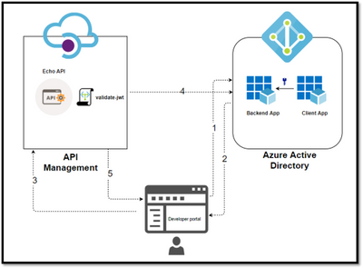

## Azure APIM and Oauth2

Based on the Microsoft Tech Community [blog post](https://techcommunity.microsoft.com/t5/azure-paas-blog/protect-api-s-using-oauth-2-0-in-apim/ba-p/2309538) by [Sherry Sahni](https://techcommunity.microsoft.com/t5/user/viewprofilepage/user-id/799624).

The API Management is a proxy to the backend APIs, it’s a good practice to implement security mechanism to provide an extra layer of security to avoid unauthorized access to APIs.

 

 In this Diagram we can see the OAUTH flow with API Management in which:

- The Developer Portal requests a token from Azure AD using app registration client id and client secret.
- In the second step, the user is challenged to prove their identity by supplying User Credentials.
- After successful validation, Azure AD issues the access/refresh token.
- User makes an API call with the authorization header and the token gets validated by using validate-jwt policy in APIM by Azure AD.
- Based on the validation result, the user will receive the response in the developer portal.

Different grant types:
 
|Grant Flow|Description|Use Case|
|Authorization Code|It is the most used grant type to authorize the Client to access protected data from a Resource Server.|Used by the secure client like a web server.|
|Implicit|It is intended for user-based clients who can’t keep a client secret because all the application code and storage is easily accessible.|Used by the client that can’t protect a client secret/token, such as a mobile app or single page application.|
|Client Credentials|This grant type is non interactive way for obtaining an access token outside of the context of a user.|It is suitable for machine-to-machine authentication where a specific user’s permission to access data is not required.|
|Resource Owner password Credentials|It uses the username and the password credentials of a Resource Owner (user) to authorize and access protected data from a Resource Server.|For logging in with a username and password (only for first-party apps)|

### High-level steps required to configure OAUTH

To configure Oauth2 with APIM the following needs to be created:

- Register an application (backend-app) in Azure AD to represent the protected API resource.​
- Register another application (client-app) in Azure AD which represent a client that wants to access the protected API resource.​
- In Azure AD, grant permissions to client(client-app) to access the protected resource (backend-app).​
- Configure the Developer Console to call the API using OAuth 2.0 user authorization.​
- Add the validate-jwt policy to validate the OAuth token for every incoming request.​​