## Authorization Code

In Authorization code grant type, User is challenged to prove their identity providing user credentials. Upon successful authorization, the token end point is used to obtain an access token. The obtained token is sent to the resource server and gets validated before sending the secured data to the client application.

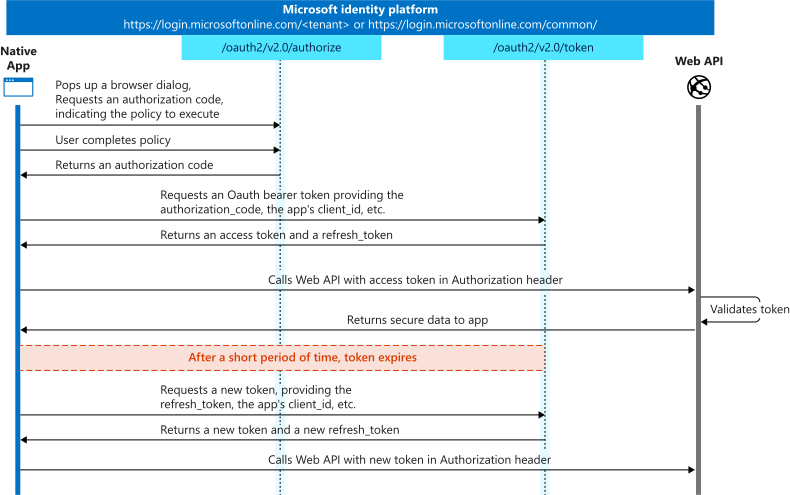


### Register an application (backend-app) in Azure AD to represent the Basic Calculator API​

To protect an API with Azure AD, first register an application in Azure AD that represents the API. The following steps use the Azure portal to register the application.


**First we need to access our the AAD tenant we created in the excercise before, be sure you are in the right tenant**. Then select App registrations under Azure Portal to register an application:

- Select New registration.

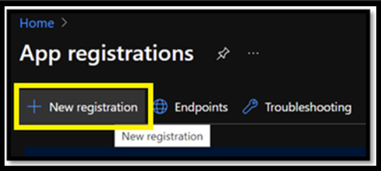

- In the Name section, enter a meaningful application name that will be displayed to users of the app. For example `oauth-backend-app`
- In the Supported account types section, select an option that suits your scenario.
- Leave the Redirect URI section empty.
- Select Register to create the application.

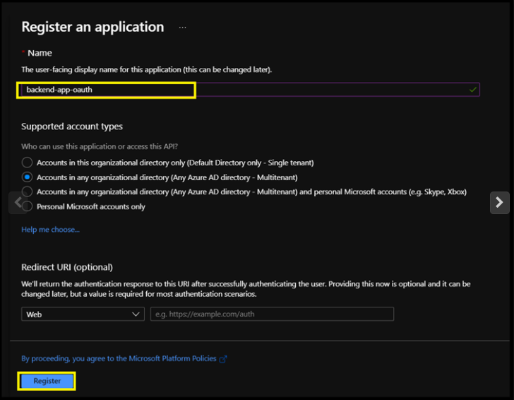

- On the app Overview page, find the Application (client) ID value and record it for later.

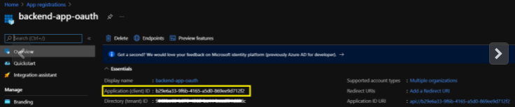

- Select Expose an API and set the Application ID URI with the default value. Record this value for later.
- Select the Add a scope button to display the Add a scope page. Then create a new scope that's supported by the API (for example, Calculator.Read).
- Select the Add scope button to create the scope. Repeat this step to add all scopes supported by your API.
- When the scopes are created, make a note of them for use in a subsequent step.

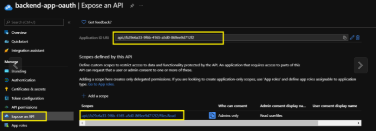

### Register another application (client-app) in Azure AD to represent the Developer Portal( client application)​

Every client application that calls the API needs to be registered as an application in Azure AD. In this example, the client application is the Developer Console in the API Management developer portal. In this case we will register another application in Azure AD to represent the Developer Console:

- Select New registration.


- In the Name section, enter a meaningful application name that will be displayed to users of the app.  For example `oauth-client-app`
- In the Supported account types section, select an option that suits your scenario.
- Leave the Redirect URI section empty.
- Select Register to create the application.


- On the app Overview page, find the Application (client) ID value and record it for later.
- Create a client secret for this application to use in a subsequent step.
    - From the left menu options for your client app, select Certificates & secrets, and select New client secret.
    - Under Add a client secret, provide a Description. Choose when the key should expire and select Add. When the secret is created, note the key value for use in a subsequent step.

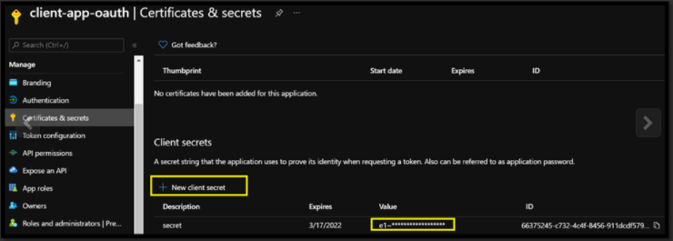

### Grant permissions for client-app to call backend-app

- Now we have to open our client app and choose the option `API permissions`
- In here we need to click on `Add a permission`
- Then choose `My APIs`
- Select the record for `backend-app-oauth`

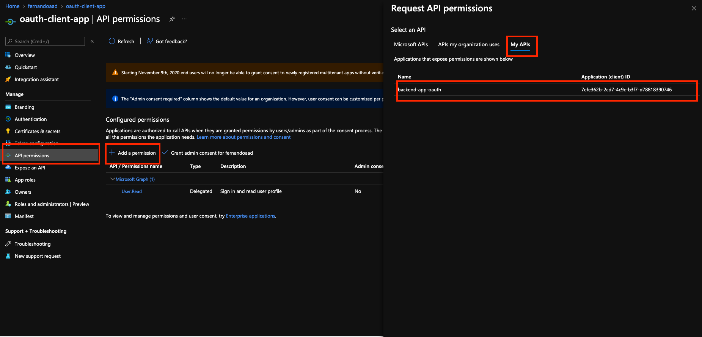

- Then select the `Delegated Permissions` option
- Then mark the `Calculator.Read` checkbox
- Then click the `Add Permissions` button

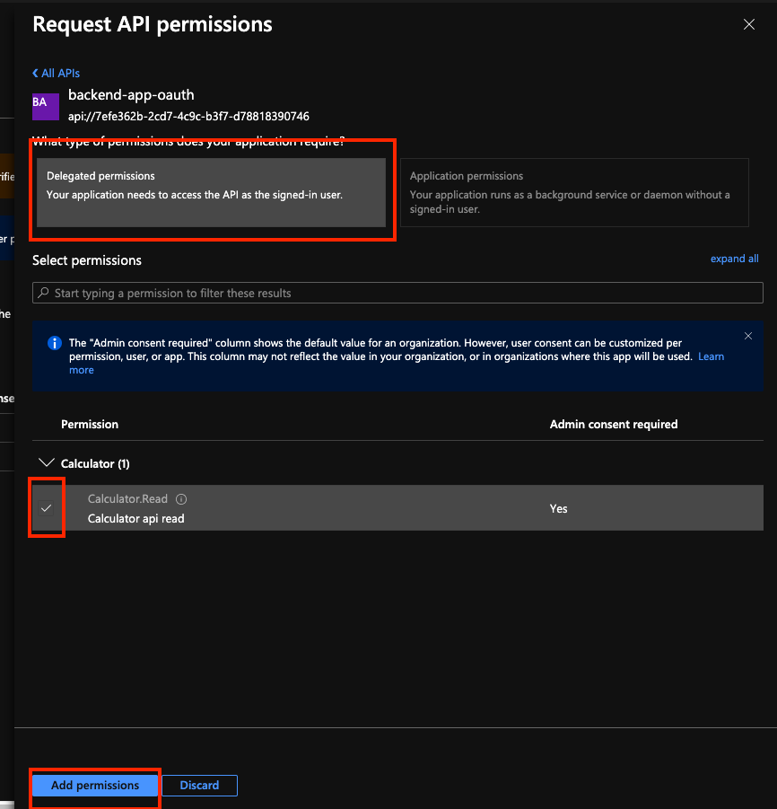

- Finally click the `Grant admin consent for ...`

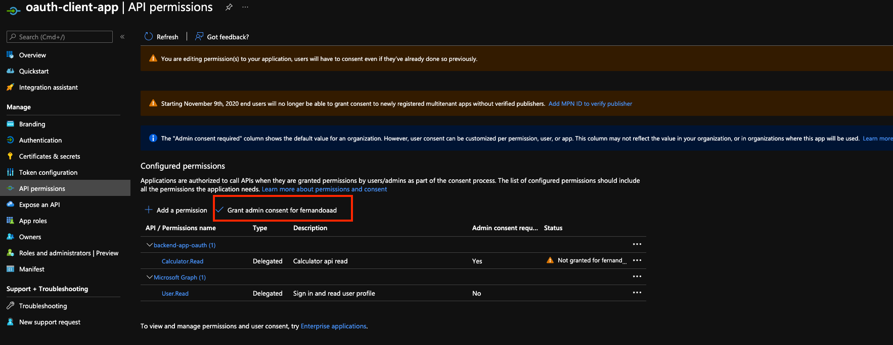


### Enable OAuth 2.0 in the Developer Console for Authorization Code Grant type

At this point, we have created the applications in Azure AD, and granted proper permissions to allow the client-app to call the backend-app.


In this demo, the Developer Console is the client-app and has a walk through on how to enable OAuth 2.0 user authorization in the Developer Console.
Steps mentioned below:

- In Azure portal, browse to your API Management instance and Select OAuth 2.0 > Add.
- Provide a Display name and Description.
- For the Client registration page URL, enter a placeholder value, such as http://localhost.
- For Authorization grant types, select Authorization code.


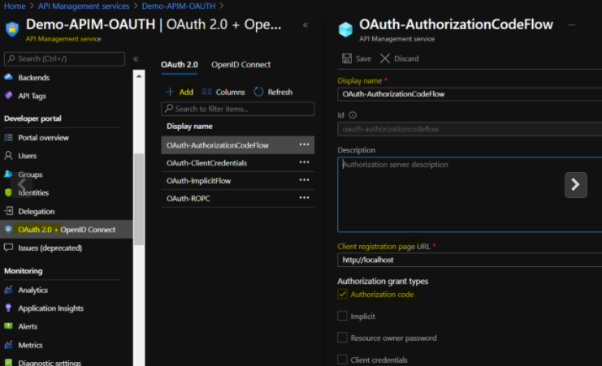

Specify the Authorization endpoint URL and Token endpoint URL. These values can be retrieved from the Endpoints page in your Azure AD tenant. Browse to the client App registrations page again and select Endpoints.

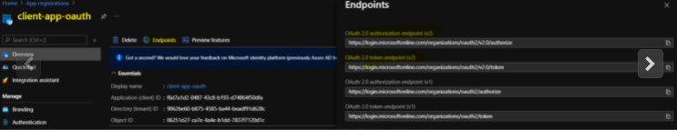

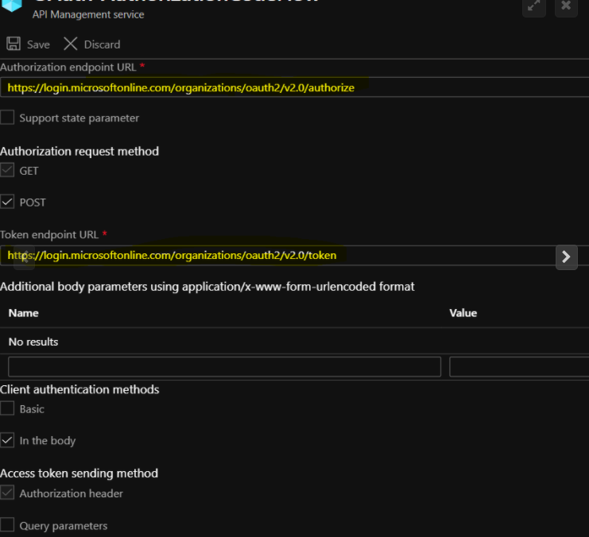

#### Endpoints versions

We recommend using v2 endpoints. When using v2 endpoints, use the scope you created for the backend-app in the Default scope field. Also, make sure to set the value for the accessTokenAcceptedVersion property to 2 in your application manifest in Azure AD Client APP and Backend app.

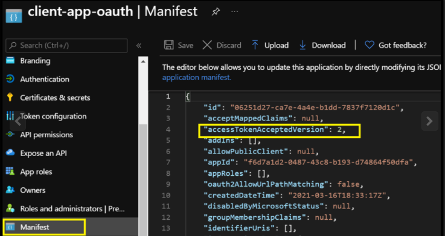

- Next, specify the client credentials. These are the credentials for the client-app.
- For Client ID, use the Application ID of the client-app.

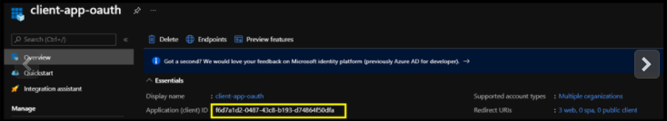

- For Client secret, use the key you created for the client-app earlier.
- Immediately following the client secret is the redirect_urls

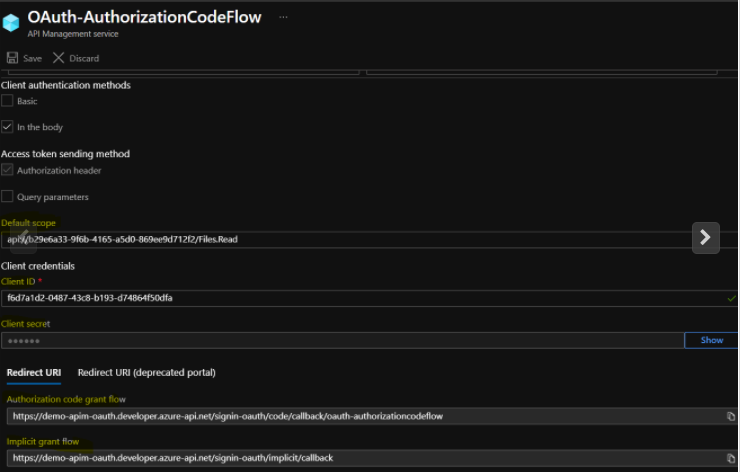

- Go back to your client-app registration in Azure Active Directory under Authentication.
- Paste the redirect_url under Redirect URI, and  check the issuer tokens then click on Configure button to save.

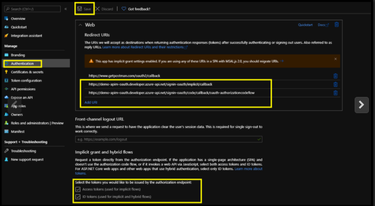

Now that you have configured an OAuth 2.0 authorization server, the Developer Console can obtain access tokens from Azure AD.

The next step is to enable OAuth 2.0 user authorization for your API. This enables the Developer Console to know that it needs to obtain an access token on behalf of the user, before making calls to your API.

- Go to APIs menu under the APIM
- Select the `Basic Calculator API` and Go to `Settings`.
- Under Security, choose OAuth 2.0, select the OAuth 2.0 server you configured earlier and select save.

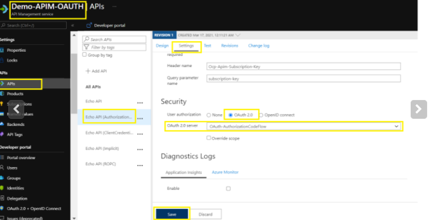

- Publish the developer portal again to refresh this changes


#### Calling the API from the Developer Portal

Now that the OAuth 2.0 user authorization is enabled on your API, the Developer Console will obtain an access token on behalf of the user, before calling the API.

- Copy the developer portal url from the overview blade of apim

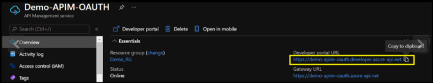

- Browse to any operation under the Basic Calculator API in the developer portal and select Try it. This brings you to the Developer Console.
- Note a new item in the Authorization section, corresponding to the authorization server you just added.

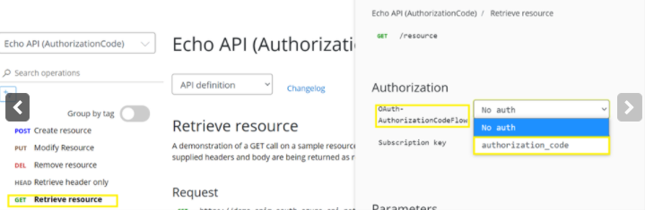

- Select Authorization code from the authorization drop-down list, and you are prompted to sign in to the Azure AD tenant. If you are already signed in with the account, you might not be prompted.

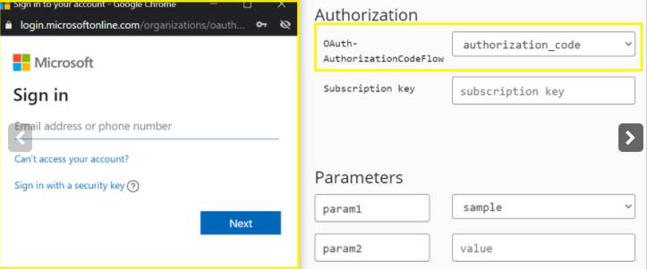

- After successful sign-in, an Authorization header is added to the request, with an access token from Azure AD. The following is a sample token (Base64 encoded):

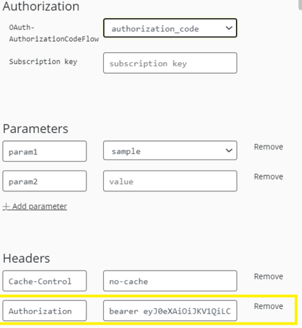

Select Send to call the API successfully with 200 ok response.

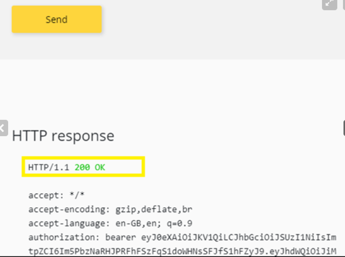

### Validate-jwt policy to pre-authorize requests with AD token:

At this point we can call the APIs with the obtained bearer token. However, what if someone calls your API without a token or with an invalid token? For example, try to call the API without the Authorization header, the call will still go through. This is because the API Management does not validate the access token, It simply passes the Authorization header to the back-end API.

To pre-Authorize requests, we can use `validate-jwt` Policy by validating the access tokens of each incoming request. If a request does not have a valid token, API Management blocks it.

We will now configure the Validate JWT policy to pre-authorize requests in API Management, by validating the access tokens of each incoming request. If a request does not have a valid token, API Management blocks it.

- Browses to the APIs from the left menu of APIM
- Click on `Basic Calculator Api` and open the inbound policy to add the validate-jwt policy(It checks the audience claim in an access token and returns an error message if the token is not valid.) and save it.

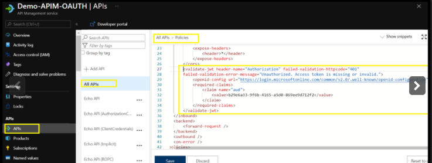

- You will need to get the id of your scope, you set from you backend-app registration. Normally this comes in the form `api://d183fdbe-fc28-4ef7-9ca1-e7b4a4cd1ff8/Calculator.read` , we need to use the id `d183fdbe-fc28-4ef7-9ca1-e7b4a4cd1ff8` as audience


``` xml
<validate-jwt header-name="Authorization" failed-validation-httpcode="401" failed-validation-error-message="Unauthorized. Access token is missing or invalid.">
    <openid-config url="https://login.microsoftonline.com/common/v2.0/.well-known/openid-configuration" />
    <audiences>
        <audience>YOUR-BACKENDAPP-SCOPE-ID</audience>
    </audiences>
</validate-jwt>
```

- Go back to the developer portal and send the api with invalid token.
- You would observe the 401 unauthorized.

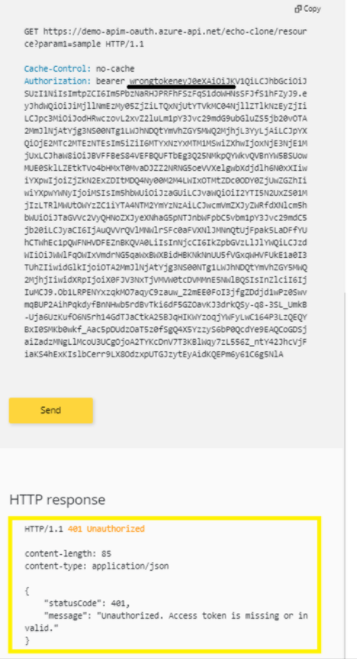

- Modify the token from authorization header to the valid token and send the api again to observe the 200-ok response.

#### Understanding validate-jwt Policy

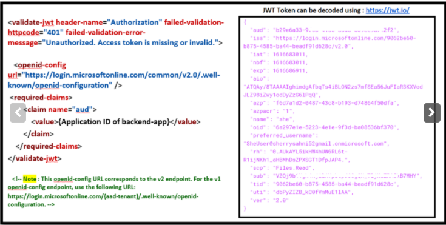

In this section, we will be focusing on understanding how `validate-jwt` policy works (the image in the right side is the decoded JWT Token)

- The validate-jwt policy supports the validation of JWT tokens from the security viewpoint, It validates a JWT (JSON Web Token) passed via the HTTP Authorization header
- If the validation fails, a 401 code is returned. The policy requires an openid-config endpoint to be specified via an openid-config element. API Management expects to browse this endpoint when evaluating the policy as it has information which is used internally to validate the token.
Please Note : OpenID config URL differs for the v1 and v2 endpoints.
- The required-claims section contains a list of claims expected to be present on the token for it to be considered valid. The specified claim value in the policy must be present in the token for validation to succeed.
    
The claim value should be the Application ID of the Registered Azure AD Backend-APP.